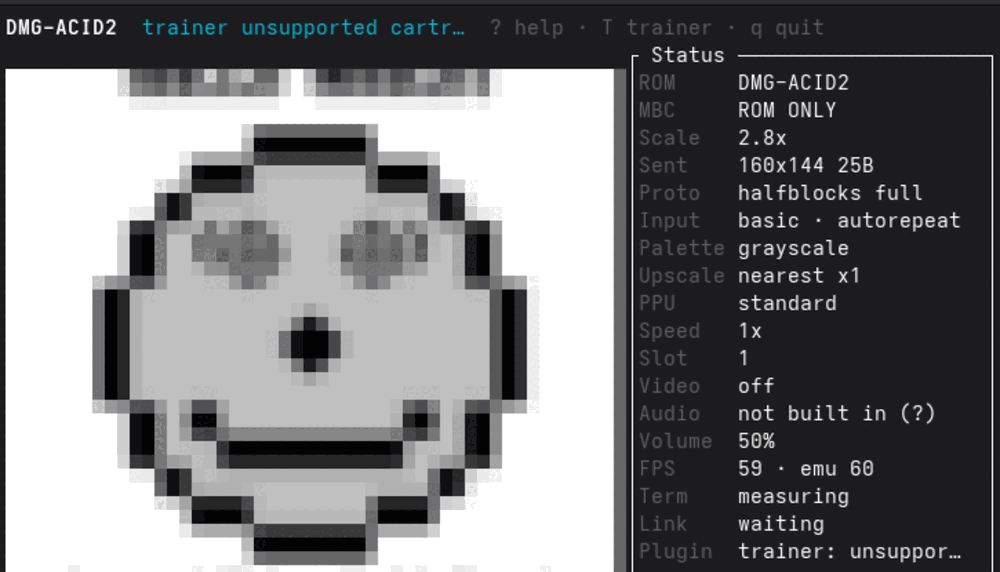
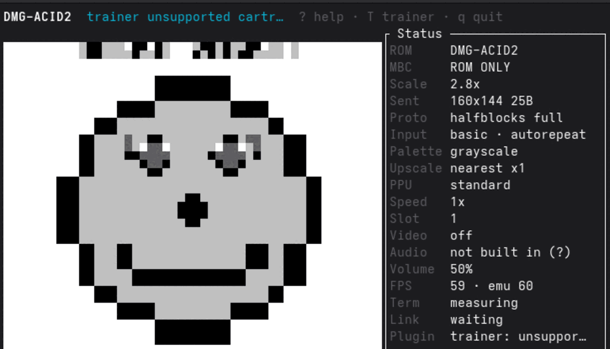

<section class="prose" markdown="1">

A terminal that speaks no image protocol gets the picture drawn out of the
upper-half-block glyph `▀`. The foreground colour paints the top half of a character
cell, the background paints the bottom, two vertical pixels per cell. That is crisp by
construction — a cell is two flat colours and there is nothing inside it that can be
soft.

And yet on Ptyxis it was visibly blurry, and on WezTerm it was not. Same binary, same
ROM, same scale.

</section>

  <figure class="pixel">
    
Before · <code>render_path = legacy</code>

    
    <figcaption>
      Every cell is a weighted average of the Game Boy pixels underneath it.
    </figcaption>
  </figure>
  <figure class="pixel">
    
After · default path

    
    <figcaption>
      Sampled nearest-neighbour at pixel centres, straight out of the framebuffer.
    </figcaption>
  </figure>

  Both captures in Ptyxis 50.1 at 80×24 cells, 2.8× scale, one binary, two render
  paths.

<section class="prose" markdown="1">

## The softness was never in the glyph

It was in the sampling, four lines down in a dependency:

<figure class="code">
  <pre><code>let img = img.resize_exact(rect.width as u32, (rect.height * 2) as u32,
                          FilterType::Triangle);</code></pre>
  <figcaption>
    <code>ratatui-image-4.2.0/src/protocol/halfblocks.rs</code>. The same crate's
    Sixel encoder does no such thing, and <code>Resize::Scale</code>'s own default
    filter is <code>FilterType::Nearest</code>. Half-blocks was the one path with a
    filter baked in — which is why WezTerm, on the Sixel path, looked right.
  </figcaption>
</figure>

Measured on dmg-acid2 at 80×24 cells: 271 distinct colours, 268 of which no Game Boy
shade maps to.

The fix samples the cells directly, nearest-neighbour at pixel centres, the same rule
the video scaler already used. It also writes a uniform cell as a space rather than `▀`,
so a font with a poor block glyph cannot soften the large flat areas a Game Boy picture
is mostly made of.

</section>

<section class="prose" markdown="1">

## Doing the work ourselves is cheaper

This is the part that surprised me. The new path pays a full sampling cost on every
frame and still wins: over roughly 1,070 frames at 146×54 cells, same ROM and window
both sides, whole-frame time went from 0.460 ms to 0.349 ms.

It replaces two `image`-crate resizes — a nearest upscale to the display's pixel size,
then a Triangle downscale back to the cell grid. One pass of arithmetic beats two passes
of somebody else's.

</section>

<section class="prose" markdown="1">

## The guard is a property, not a pixel

Blur has now been reported twice here, so the regression test asserts the thing that
matters: **every colour on screen must be a colour that was in the framebuffer.** No
interpolating resampler can satisfy that.

One unit test runs a one-pixel checkerboard — the worst case for a smoothing filter — at
five window sizes. One end-to-end test drives the real render on dmg-acid2 at four.

  
The same trap, one repository over

  

    <a href="../projects/pixelgb.html">PixelGB</a> extracts map art from a running
    cartridge and guards its output on the same rule — no colour may appear that was
    not in the source — and cites this incident as the reason.
  

</section>
