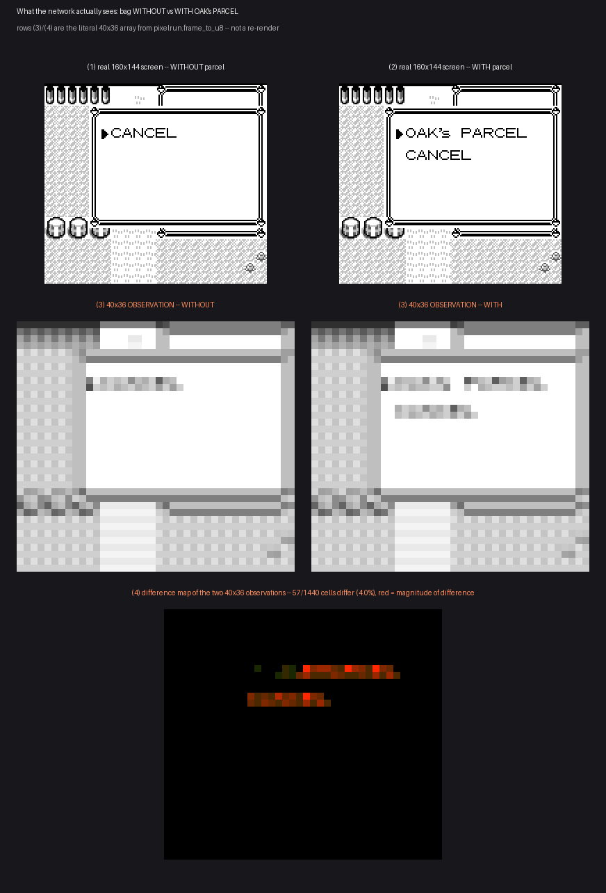

<section class="prose" markdown="1">

## Two wrong answers first

Attempt one tested two message pairs at N=5 and got balanced accuracy 0.50: chance.
Attempt two sharpened the question and got 0.33: still chance.

Both were undermined by the same thing. Three to five examples per class lets a probe
predict one class always and look exactly like chance.

</section>

<section class="prose" markdown="1">

## The answer with real N

Dozens of genuine frames per message, taken from the typing animation itself, over six
distinct in-game messages. Nearest-centroid across all six identities, with a temporal
split — train on each message's first 65% of typing, test on the last 35% it has never
seen.

**97.2% accuracy against 20.0% chance**, N=36 held out, permutation p &lt; 0.005. The
confusion matrix is essentially the identity matrix.

What survives is shape, not letters: line length, word-wrap position, letter density per
region.

One of the six messages had to be captured from a separate session, and its background
differs from the other five by 14 of 1,440 cells, all inside one small icon. Removing
that message entirely, or masking those 14 cells, moves the headline by about one point.

</section>

<section class="prose" markdown="1">

## The version that mattered in practice

Compare the bag opened with an empty item pocket against the same bag holding Oak's
parcel. **57 cells of the 40×36 observation separate the two states perfectly**, and not
one of them requires reading a letter.

A goal marker does not have to be legible text. A reliable change in layout is enough.

</section>

<figure class="pixel">
  
  <figcaption>
    The real screen, the actual observation, and a difference map, for the bag with an
    empty item pocket against the same bag holding the parcel. The separating cells are
    a change in layout, not a legible word.
  </figcaption>
</figure>

<section class="prose" markdown="1">

These are fresh linear probes and nearest-centroid classifiers fit on frozen
observations, not a trained student network, so there is no weights file to name against
them.

</section>
