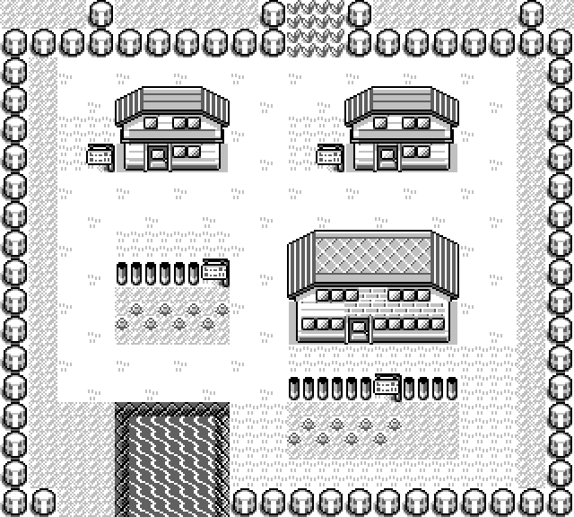

<section class="prose" markdown="1">

## Outdoors is the cartridge's

The 36 connected maps go where the connection records put them. Exact arithmetic, no
search: a connection record names one block twice — once in the neighbour's block data,
once where the engine copies it — and one block in two frames is an exact offset.

Every chain of connections that arrives at a map puts it in the same place. Zero
placement disagreements.

</section>

<section class="prose" markdown="1">

## Indoors is a decision, but the door is not

An interior has no connections at all. The cartridge says which door leads to it and
nothing about where the room is. So the rule is one sentence: a building is drawn
adjacent to the map its door is in, on the side that door is on, in line with it.

What follows from that took several rounds, and the way to compare them is the
room-to-door distance over the rooms every layout can measure:

  <table>
    <thead>
      <tr><th>Layout revision</th><th class="num">Door distance mean / median</th><th class="num">Nearer another region's door</th><th class="num">Out of door order</th></tr>
    </thead>
    <tbody>
      <tr><td>Before the whole-map review</td><td class="num">715 / 456 px</td><td class="num">92 of 169</td><td class="num">16 of 71</td></tr>
      <tr><td>After it</td><td class="num">599 / 383 px</td><td class="num">85 of 184</td><td class="num">—</td></tr>
      <tr><td>After three reported faults</td><td class="num">503 / 350 px</td><td class="num">79 of 184</td><td class="num">—</td></tr>
      <tr><td>Doors' order as the primary key</td><td class="num"><strong>494 / 305 px</strong></td><td class="num"><strong>72 of 184</strong></td><td class="num"><strong>0 of 71</strong></td></tr>
    </tbody>
  </table>

</section>

<section class="prose" markdown="1">

## Ordering has to outrank nearness, and the weight was measured

Two buildings whose street doors are on the same side of the same town must be drawn in
the doors' own order along that side. Added as an ordinary term in the distance cost,
that loses every time: an inversion the eye reads at a glance is worth only a few pixels
of nearness, and a building will buy the pixels. Which is how Cinnabar's gym came to be
drawn below the two shops whose doors are eight tiles below its own.

At weight 4 the cartridge still has five pairs the wrong way round. At 8 it has none.
From 8 to 16 the layout does not move at all.

And "not the wrong way round" turned out to be a loophole the search will find. With
equality free, seven pairs came to rest exactly level — Saffron's gym and mart among
them, the very pair that was complained about. Making the ordering strict cost nothing:
same mean, same median, same sheet.

</section>

<figure class="pixel narrow" style="margin-inline:auto;">
  
  <figcaption>
    Pallet Town, the worked example. Red's house at tile (5,5) files left; Blue's at
    (13,5) and Oak's lab at (12,11) file right, with Blue's house above the lab because
    its door is six tiles above the lab's. The community's hand-authored atlas puts
    those four panels on those same two sides in that same order, which is independent
    confirmation of the rule and not its source.
  </figcaption>
</figure>

<section class="prose" markdown="1">

## One warp in the cartridge is not a door

Celadon City's ninth warp, tile (39,19), drops you into map 136 — the department store's
fifth floor. That floor's own three warps lead to the roof, the fourth floor and the
lift; none of them leads back to the street. Read as a street door, it filed one floor
of the store 254 tiles from the other six, on the opposite side of the city.

So an outdoor warp counts as the way in only when the room it reaches has a warp back to
the map you came from. Map 136 is the only map in the cartridge that fails that test,
and with the rule in place the store lands as one column of seven.

Victory Road looks like the same bug and is not. Route 23 has two street doors of its
own, into 1F and into 2F, and both rooms walk back out. The route is 20 tiles wide, so
those doors are genuinely on opposite sides of it and the two halves file either side.
The community's hand-authored atlas bundles them; the cartridge does not, and the
cartridge wins.

</section>

<section class="prose" markdown="1">

## A building that will not fit comes apart at one of its own doors

The S.S. Anne is entered through Vermilion's dock rather than off the street, so the
dock, the ship and its eleven rooms are one building. A twelve-room block wants about a
million square pixels of one rectangle, and that does not exist within two screens of
Vermilion. Every arrangement of it as one block put it beyond Route 12, further from its
own town than anything else in the cartridge.

It was not mis-assigned and the search was not failing. Measured against the finished
sheet, where it stood was the nearest place a single rectangle of that size would go.

So a building may be cut at one of its rooms, and the rooms behind that door become a
wing, placed by the same rule with "the map" now meaning a room of its own building.

What is not negotiable through any of that: a panel never covers walkable world or
another panel. The finished rectangles are checked and an intersection fails the render.
That assertion is worth more than the rule it guards, because it is what makes the next
change to the layout safe.

</section>
