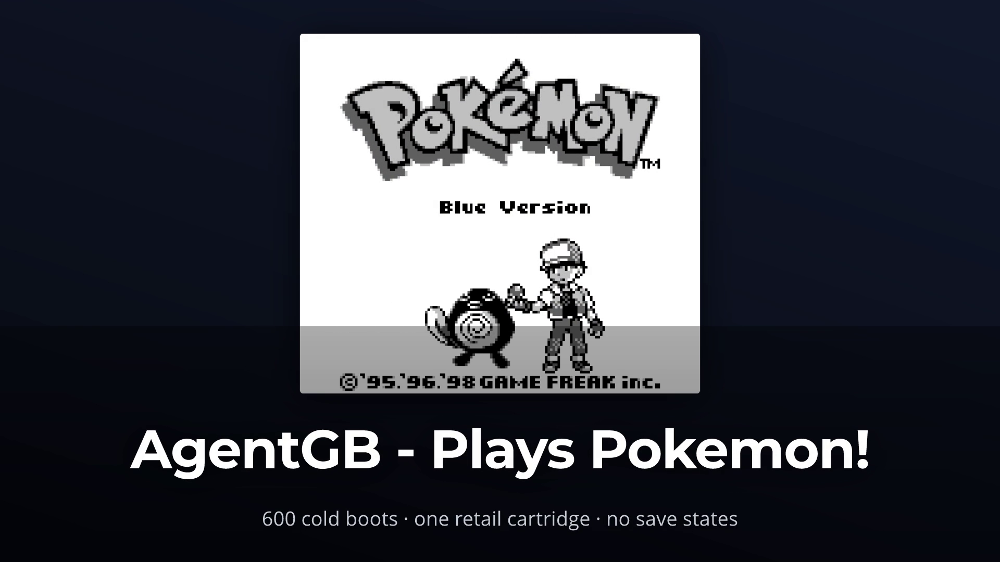
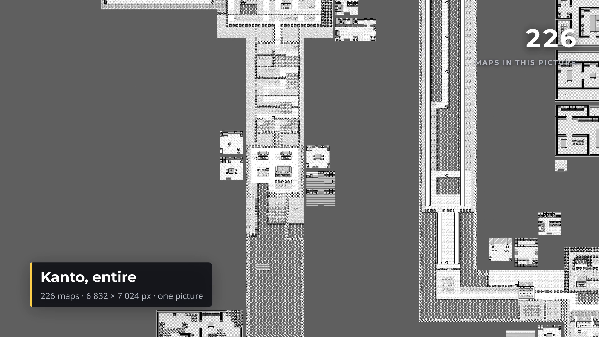
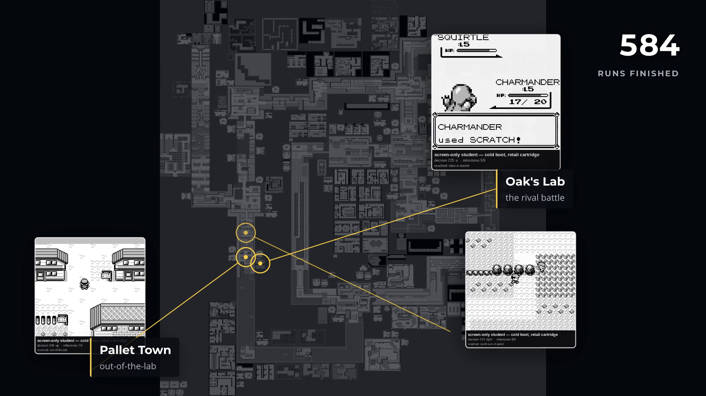

<section class="prose" markdown="1">

## Two of the three already existed

PixelGB already renders every one of Pok&eacute;mon Blue's 226 maps into one picture,
6,832 &times; 7,024, 48.0 megapixels, with the seams between towns and routes measured
rather than eyeballed. AgentGB already turns a swarm of parallel cold boots into real
Game Boy footage — the same runs this blog already writes about, not a re-enactment of
them. And the narrow phone cut this needed was already policy rather than a new problem:
Telegram's `sendVideo` refuses 60fps outright, at any file size, so a 720p/30fps pass
has been the standard delivery output for a while.

Two-thirds of the job was already sitting on disk, done, and nobody had noticed.

</section>

<section class="prose" markdown="1">

## The piece that didn't exist

Nothing in the house could zoom or pan across a still that large, or choreograph several
independently-timed clips appearing at chosen positions on cue. That's a camera and a
scheduler, not a renderer — and it's exactly what a tool like Remotion is for.

Remotion's own documentation doesn't put a number on the one thing that actually
mattered here: whether a smooth pull-back over an image that size performs at all. Not
"renders eventually" — holds something close to real time, for a shot that needs nine
continuous seconds of it. That was the one genuine unknown, and it was the kind of thing
that could have ended the idea before it started.

</section>

<section class="prose" markdown="1">

## Building our own instead of adopting theirs

The licence was never actually the obstacle. Remotion is free for one person working
alone, personal or commercial use either way, so the open-source-versus-paid-seat
question people expect never came up. What decided it was smaller than that: the piece
Remotion would actually contribute — a camera and clip choreography over footage we
already generate — is a well-understood technique, and building it cost about the same
as learning somebody else's framework well enough to trust it. Minus the ~300MB Chromium
download and a Node toolchain nothing else here uses.

So: ShowReel. A Rust crate — eighteen modules, a little over 8,600 lines — that takes a
description of a film and renders it, deterministically, to an mp4. `tiny-skia` and
`rustybuzz` draw the pixels and the glyphs; `ffmpeg` encodes. No browser, no Node, no
headless Chromium. From the point the Remotion question was answered to a rendered film
was under two hours.

The film itself is 393 lines written against nothing but that public API — a title
screen, a camera move, five bursts of footage, a pull-up naming one of them. Nothing in
the crate underneath it knows what a map or a Pok&eacute;mon is; every map rectangle and
clip timestamp lives in that one file, as input.

</section>

<figure aria-labelledby="fig-title-cap">
  
  <figcaption id="fig-title-cap">
    The opening frame. The cartridge's own title screen, captured headlessly and framed by
    ShowReel — not a picture of one.
  </figcaption>
</figure>

<section class="prose" markdown="1">

## The number that mattered

The test that answered the risky question: a 120-frame pull-back over the actual 6,832
&times; 7,024 atlas, rendered down to 1920 &times; 1080.

  <table>
    <thead>
      <tr>
        <th>Approach</th>
        <th class="num">ms / frame</th>
        <th class="num">120 frames</th>
      </tr>
    </thead>
    <tbody>
      <tr><td>Crop and resample from full resolution, one thread</td><td class="num">142.1</td><td class="num">17.05 s</td></tr>
      <tr><td>Mip pyramid, one thread</td><td class="num">42.2</td><td class="num">5.06 s</td></tr>
      <tr><td><strong>Mip pyramid, 20 threads</strong></td><td class="num"><strong>4.3</strong></td><td class="num"><strong>0.52 s</strong></td></tr>
    </tbody>
  </table>

33&times; faster than the obvious version, and around 8&times; faster than real time for
the actual shot.

The reason is choosing an already-shrunk copy of the image before resampling, instead of
reading the full 48 megapixels on every single frame regardless of how much of it ends
up on screen. Cost becomes proportional to the output size rather than the source size —
close to constant, whatever the zoom. Building that pyramid once, at load, costs 523
milliseconds and holds 192MB resident afterward. When the camera pushes in rather than
pulls back — a Game Boy screen blown up to fill the frame — the same code switches to
nearest-neighbour resampling instead, so the pixel art stays sharp rather than turning
to mush.

</section>

<figure aria-labelledby="fig-pullback-cap">
  
  <figcaption id="fig-pullback-cap">
    Partway through the nine-second move — the camera is well off its 1:1 opening on
    Pallet Town, still short of the whole atlas.
  </figcaption>
</figure>

<section class="prose" markdown="1">

## Where it actually happened

The whole opening chain — leaving the bedroom, the rival battle, out of the lab, north
up Route 1 — happens within a few hundred pixels of Pallet Town. On a picture of the
whole region, that is a few dozen screen pixels. Every burst in the finished film
clusters there, because that is where the footage covers, not because the film is
choosing to.

So each clip sits at the edge of the frame instead, and a line is drawn back to the map
coordinate it actually happened at.

  
&ldquo;The line is the claim, not the position.&rdquo;

  <cite>What the footage placements are allowed to say</cite>

</section>

<figure aria-labelledby="fig-bursts-cap">
  
  <figcaption id="fig-bursts-cap">
    Three clips live at once, each on its own line back to the map. The Oak's Lab inset is
    mid-battle: Charmander using Scratch, a frame out of a real cold boot on the retail
    cartridge.
  </figcaption>
</figure>

<section class="prose" markdown="1">

## What it doesn't do

There's no audio — every encode ShowReel produces drops the input track outright. Memory
is spent on footage, not on the picture: the finished film holds over a gigabyte of
decoded video clips in memory at once, about six times what the 48-megapixel atlas
itself costs once it's been reduced to its pyramid.

There's no scrubbable preview player either, the thing Remotion's own docs lean on
hardest. In its place: a single frame in about a tenth of a second, a whole labelled
contact sheet of the film in three seconds, and a genuinely scaled-down preview pass in
under seven — all well short of the 25 seconds a full render takes. That loop is what
caught a caption running off the edge of the frame before a single second of video was
ever encoded.

</section>
