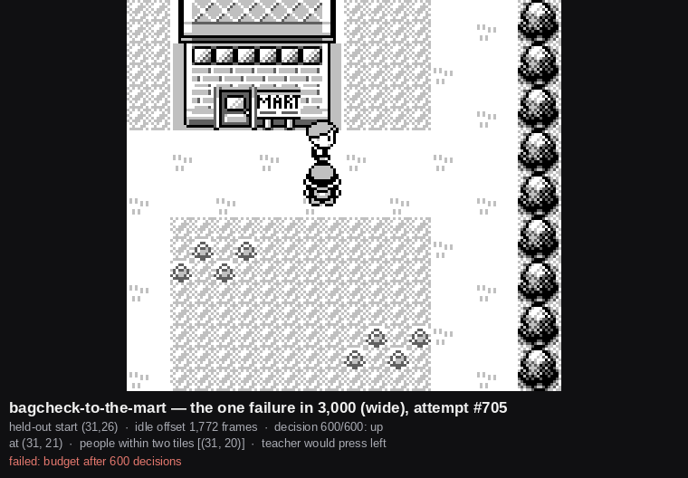

<section class="prose" markdown="1">

It reproduces exactly. A certification's start states are a pure function of the link,
the held-out split, the seed and the spread, so no rollout has to be kept for an attempt
to be run again: attempt #705 of 3,000, held-out start (31,26), start offset 1,772
frames. Re-run, it fails the same way. The fifteen other attempts from that same tile
all reach the goal in 30 to 67 decisions.

</section>

<figure class="pixel">
  
  <figcaption>
    The last frame of the run. The Mart is at the top of the screen and the student
    never reaches it: it walks up column 31, meets somebody standing on (31,20) — the
    corner tile, the one place its route has to turn — and presses up into that person.
    The shop is in view, the person is in the way, the budget is gone.
  </figcaption>
</figure>

<section class="prose" markdown="1">

## The anatomy

  <table>
    <tbody>
      <tr><td>Where it stood</td><td>(31,21) for 533 of 600 decisions</td></tr>
      <tr><td>What it pressed there</td><td><code>up</code> 177, <code>start</code> 89, and 267 more with a menu on screen</td></tr>
      <tr><td>What the teacher would have pressed</td><td><code>left</code> 177 — a clean 177-for-177 divergence</td></tr>
      <tr><td>Its own probabilities on those 177</td><td>p(<code>up</code>) median 0.926; p(<code>left</code>) median 0.020, max 0.107</td></tr>
      <tr><td>One press of <code>left</code>, at the moment it is stuck</td><td>reaches the goal in 79 decisions</td></tr>
    </tbody>
  </table>

</section>

<section class="prose" markdown="1">

## Three explanations, all closed by measurement

**Not the route.** The teacher, driving from the same tile with the same offset, reaches
the Mart in 30 decisions. There is a way round and the privileged player finds it.

**Not a wanderer who would eventually move.** The person steps twice, at decisions 13
and 61, reaches (31,20), and then does not move for the remaining 533 decisions — about
17,000 frames, or 4.7 minutes of game time. Checked under four different player
behaviours from the stuck moment, including backing off a tile and standing still, and
pacing 266 tiles up and down. It stays parked in all four.

**Not the bag check.** The run spends 301 of its 600 decisions with a menu on screen,
but the menus are not what pins the person: an arm that presses only `b` runs the
overworld continuously for 533 decisions and the person does not move either.

</section>

<section class="prose" markdown="1">

## Which weights these rows belong to

Every rate for this link predates a corpus re-collection on 23 Aug 2026. The round-0
corpus it was trained from carried 105 leaked frames; a fresh corpus collected under the
fix audits clean, and no student has been retrained or re-certified on it. The
certification file does not record which weights it ran, so these rows are marked
unattributed rather than filled in from a directory convention.

This is a measurement of one reproducible attempt. It has not been re-measured since.

</section>
