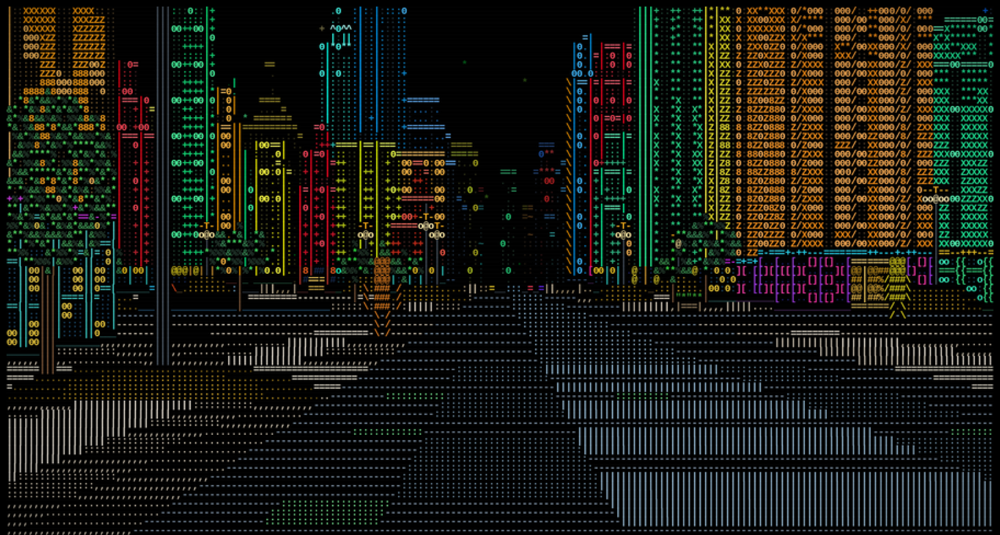
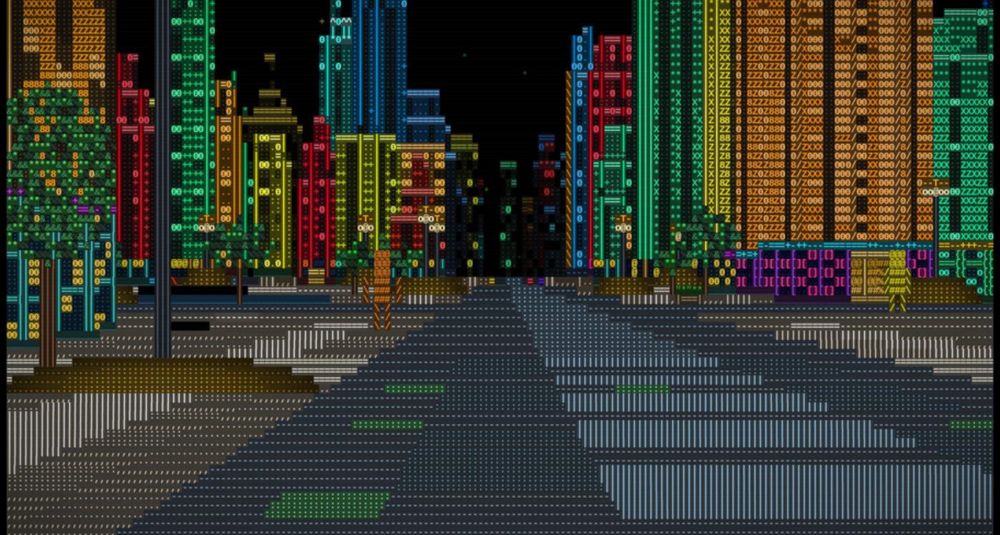
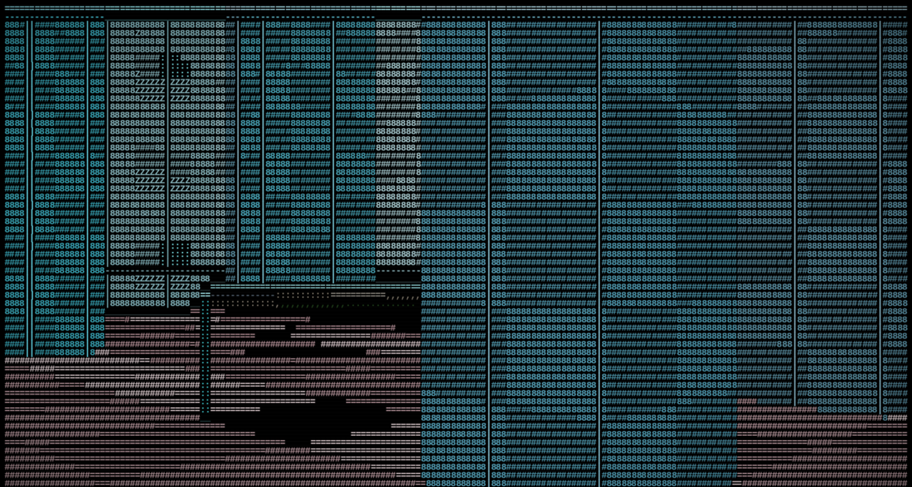
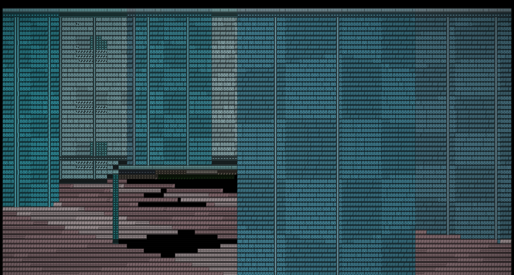

<section class="prose" markdown="1">

## The gap was one sentence

Every building here already carries a named hue — one of six facades, from a neon grid
green to a red terminal orange — and every vehicle and street surface picks its own
colour the same way. Walk the street and the red tower, the cyan tower and the yellow
tower are plainly three different buildings. But the hue was only ever the glyph's
colour. The cell behind each character stayed black, so at any distance a building
dissolved back into a scatter of coloured dots on black — the exact thing an ASCII
renderer is always accused of looking like.

The reference engine does the opposite: the wall is a filled block of one hue with
detail drawn *on* it, the road is a colour, a taxi is a filled yellow shape with wheels.
Nothing in its frame is a bright glyph floating on black. The whole difference between
the two comes down to one sentence: it colours the cell; this one coloured the glyph.

</section>

  <figure>
    
Classic

    
    <figcaption>Coloured glyphs on black — the look every capture on this site has shown until now.</figcaption>
  </figure>
  <figure>
    
Blocks

    
    <figcaption>Same seed, same position, same everything else. The road stops being the largest black shape in frame.</figcaption>
  </figure>

  
&ldquo;It colours the cell; this one coloured the glyph.&rdquo;

  <cite>The whole gap, in one sentence</cite>

<section class="prose" markdown="1">

## The plumbing was already there

The surprise is how little of this turned out to be new. The frame buffer has carried a
per-cell background plane — three bytes a cell — since registration plates needed one: a
plate is black characters on yellow, which a foreground colour alone can't say. Every
way the engine turns a frame into a picture already reads it — the terminal writer emits
the colour run, the evidence SVG draws a filled rectangle under the text, the wasm
bridge hands the whole plane to the browser's own painter. None of that is new code.
It's been wired end to end since the plate work landed, and on every frame that wasn't a
registration plate it painted nothing, because nothing ever set it.

That made the fill a rendering change, not a data one. Every place the renderer already
picks a glyph's colour already has the hue in hand — `Grid::put` just also writes a flat
0.30 downscale of that same colour into the background plane and raises a flag saying
the cell is filled. One factor on all three channels keeps the hue exact and keeps the
per-cell lightness variation that gives a wall its depth: a brighter wall cell gets a
brighter, still-dark fill. The world model needed nothing new — no field on a building,
a car or a cell — because the fill is derived at the moment it's drawn, not stored
anywhere.

</section>

<section class="prose" markdown="1">

## Why a view, not a flag

Because the background plane costs nothing while it's black, turning the fill on could
be gated behind a single per-frame check — the same check that already made the plate
work free on every frame without one. That's what let this ship as `--view
classic|blocks|middle`, read the same way `--weather clear|rain|downpour` already is,
rather than as a setting that quietly changed the default look. Classic isn't a second
code path kept alive for compatibility; it's the fill code simply not running. Every
capture and every film already on this site stays exactly the frame it was shot as.

That distinction was checked, not assumed: three scripted `--capture` walks in `--view
classic` came back byte-identical to the frames the engine wrote before any of this
landed. And it's worth being straight about the reference clip here too — its whole four
minutes are the new look, with no old-view section and no side-by-side. That it can fall
back to a bare-glyph mode is a credible claim about how engines like this are usually
built, but it isn't demonstrated in the source. Proving reversibility here, rather than
assuming it, is the actual difference between a view and a repaint.

</section>

<section class="prose" markdown="1">

## The three things that weren't free

Deriving the fill from a hue the engine already had was the easy 90%. Three things
needed real work:

- <b>The ground had gaps.</b> A road cell whose glyph is a space was simply skipped, so
the street was already speckled — colour on the characters, black between, and the
road is the single largest black area in any frame. In a filled view the ground now
writes its fill even where no glyph lands. It's the single change that opens the
street up the most.
- <b>Contrast had to be designed, not just derived.</b> A glyph on a fill of its own hue
can vanish if the two lightnesses sit too close. A flat 0.30 downscale — tried by eye
against 0.24 and 0.38 side by side — keeps the ink about 3.3&times; brighter than its
own field at every lightness, so it can't disappear even in the tightest case: amber
on amber, a hue with no chroma to fall back on, only luminance.
- <b>Plates had to stay plates.</b> The legibility scorer that grades a registration
reads runs of coloured background, so once the whole city has one, a filled frame
could read as one enormous plate. It didn't need fixing — the scorer already
disambiguates a plate from its surroundings by a separate plate mask, not by the
background colour itself — but that had to be checked, not assumed, and it's now a
named test rather than a hope.

</section>

<section class="prose" markdown="1">

## Indoors, the same rule holds

The reference engine's buildings read as one flat hue apiece; this engine's walls vary
lightness cell to cell for depth, and that variation was the one thing not up for
negotiation. Fill and keep the gradient, or the change is a downgrade wearing an
upgrade's clothes.

</section>

  <figure>
    
Classic

    
    <figcaption>A room, same as every interior shot on this site until now.</figcaption>
  </figure>
  <figure>
    
Blocks

    
    <figcaption>Same room, same position. The wall still reads as a wall with depth on it, not a flat panel.</figcaption>
  </figure>

<section class="prose" markdown="1">

## What it costs, measured here

Filling the background is new work on the hottest path in the renderer, so it was
measured rather than assumed — six interleaved pairs of 400 frames at 180&times;60,
`tools/bench-view.sh`, the same binary run in `--view classic` and `--view blocks`
alternately so machine load lands on both equally:

  <table>
    <thead>
      <tr><th>View</th><th class="num">mean ms/frame</th><th class="num">delta</th></tr>
    </thead>
    <tbody>
      <tr><td>classic</td><td class="num">0.614</td><td class="num">—</td></tr>
      <tr><td>blocks</td><td class="num">0.732</td><td class="num">+19.2%</td></tr>
    </tbody>
  </table>

  The machine wasn't fully settled while this ran — load average sat around 7–8 rather than
  the under-0.5 the project's own benchmarking notes ask for — but the method is interleaved
  pairs precisely so steady background load lands on both sides equally, and it reproduces
  the project's own +19% figure for the street almost exactly. Most of the cost is in
  <em>paint</em>, not the renderer itself: a filled frame emits a terminal colour-change
  sequence wherever the fill colour changes, where a classic frame emits none. Classic stays
  the default, and stays free — nothing pays this cost unasked.

</section>

<section class="prose" markdown="1">

## The render got faster along the way

Profiling render broken down by pass, to see where the fill's cost was landing, found
two passes doing work once a column that only depends on the row — sky was recomputing
an elevation angle per cell instead of once a row, and ground was re-deriving the same
world cell down a column where one screen cell spans several rows of it. Both were
hoisted out.

Measured the same way, interleaved against the build immediately before this change, six
pairs of 400 frames at 180&times;60:

  <table>
    <thead>
      <tr><th></th><th class="num">mean ms/frame</th><th class="num">delta</th></tr>
    </thead>
    <tbody>
      <tr><td>before</td><td class="num">0.644</td><td class="num">—</td></tr>
      <tr><td>after, <code>--view classic</code></td><td class="num">0.614</td><td class="num">&minus;4.7%</td></tr>
    </tbody>
  </table>

  The "after" binary includes the whole view-mode change — the extra branch on every pass
  that checks whether to fill — and it's still faster than the build before it existed,
  because the two hoists pay for the new branching several times over. Under the same
  machine conditions as the table above, so read the absolute numbers with the same
  caution; the direction and the rough size of the win are the finding. <code>walls</code>,
  the single most expensive pass, was left alone — it has no redundant work to hoist out,
  and chasing a few percent there risks the look for not much.

</section>

<section class="prose" markdown="1">

## What shipped

Three named views, run the same way weather is and toggled live with `B` while you walk:

  <table>
    <thead><tr><th>View</th><th>What it does</th></tr></thead>
    <tbody>
      <tr><td><code>--view classic</code></td><td>coloured glyphs on black — the look every capture on this site showed before this change, and still the default</td></tr>
      <tr><td><code>--view blocks</code></td><td>a filled colour field behind every surface — buildings, road and traffic alike</td></tr>
      <tr><td><code>--view middle</code></td><td>the buildings filled, the road and traffic left bare — a lit skyline over a dark street</td></tr>
    </tbody>
  </table>

All three work everywhere the engine runs — `--vista`, `--capture`, `--film`,
`--doorway`, `--lift`, the browser build — because the fill isn't a fourth picture the
renderer draws. It's the frame buffer's own background plane, finally filled.

</section>
