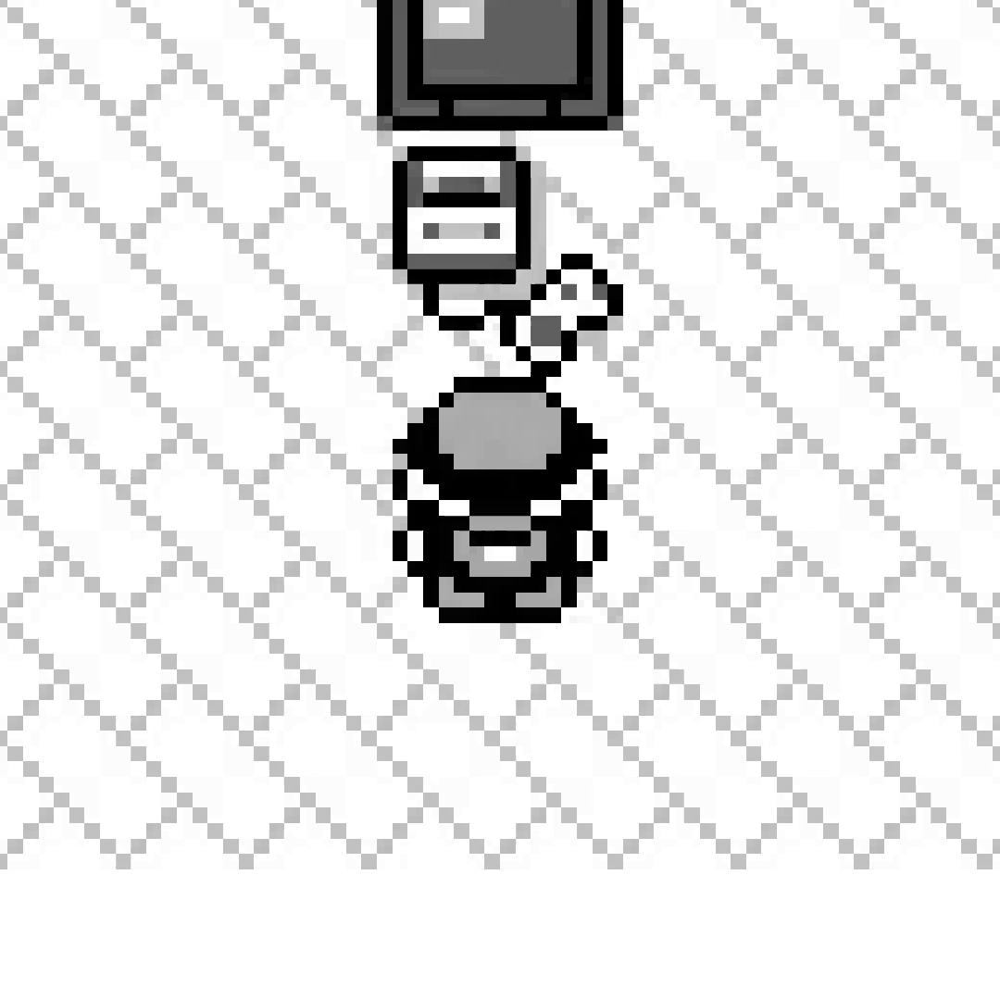
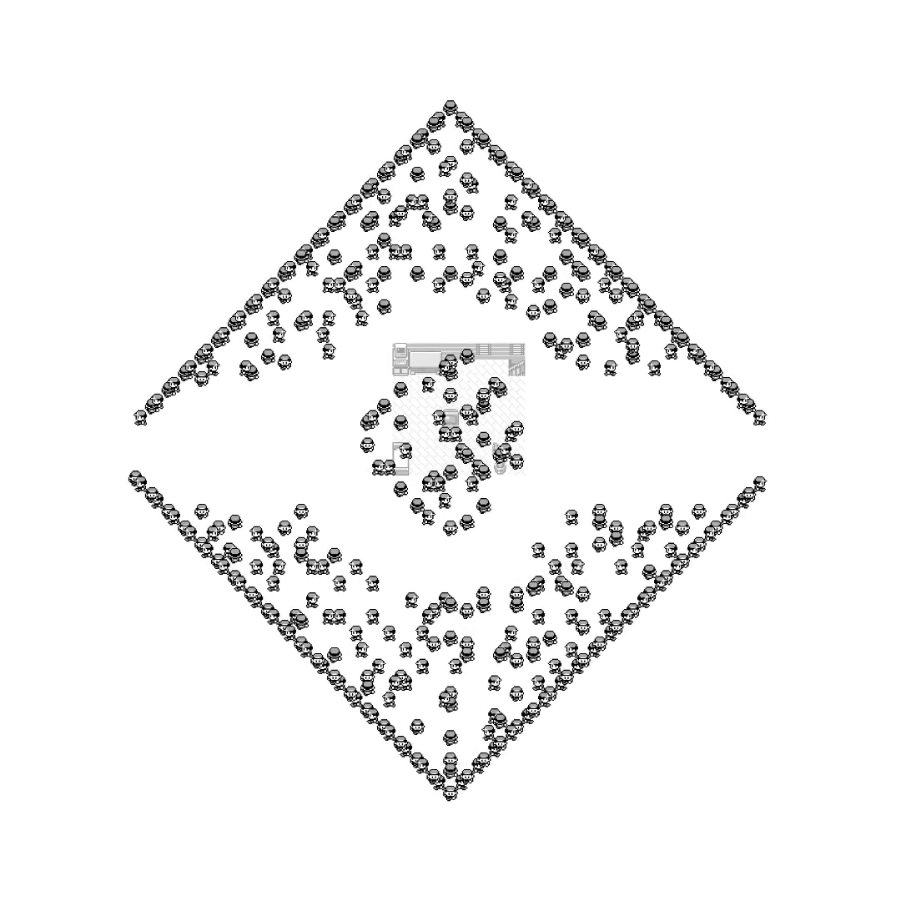
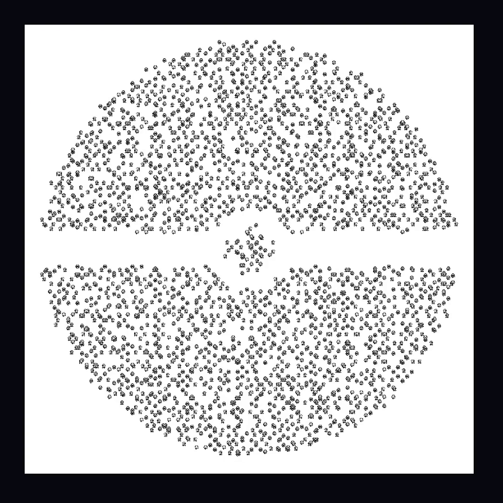

<figure>
  <video controls preload="metadata" poster="../assets/img/agentgb/livingart-poster.png"
         width="540" height="540">
    <source src="../assets/video/agentgb/livingart-bedroom-to-pokeball-mobile.mp4" type="video/mp4">
  </video>
  <figcaption>
    The finished shot. One character, alone, in Red's own bedroom — then the room fades
    as the crowd walks itself outward into a Pokéball, and keeps moving once it arrives.
    No cut anywhere in this file.
  </figcaption>
</figure>

<section class="prose" markdown="1">

## A blank stage, no map, no cartridge room

`pixellivingart` is a third swarm mode alongside AgentGB's existing teacher-run and
custom-run films, and it throws out everything a Game Boy map usually provides. No
walkable-tile graph, no room, no live emulator beyond one one-time read of the
character's own sprite pixels straight out of VRAM and OAM — the sprite doesn't depend
on the room, so any saved state serves. Everything else on screen is synthetic: a target
shape, an assignment of agents to points on it, and a path from wherever each one starts
to the point it was given.

A shape is one flag — `pokeball`, `text:WORDS`, or `image:path.png` — and the tile grid
it gets sampled onto sizes itself to the shape's own ink and the requested crowd, rather
than a fixed resolution regardless of either. A filled disc needs a much smaller grid
than thin letter strokes for the same agent count to read as a crowd instead of a
speckle: the Pokéball, 59.3% foreground at a cheap probe resolution, sizes to a
96&times;96 grid for 3,000 agents at 55% target occupancy. Every agent is then handed
its nearest still-free point on a KD-tree, walks there on the same grid path AgentGB's
other swarm films already use, and — the whole point of the exercise — does not stop
once it arrives. It jitters in place, or the whole shape slowly turns, or agents trade
places with their neighbours on the shape itself. A formation that freezes the instant
it forms was the one thing rejected outright.

</section>

<section class="prose" markdown="1">

## Six bugs, and only the last one hid

The render above is not the first take. The first three were rejected, and the reasons
kept turning out not to be about the thing that looked wrong.

</section>

<figure class="narrow">
  
  <figcaption>
    The true opening frame. One character, on the floor, facing up — not standing on the
    TV, which is where an early cut had it.
  </figcaption>
</figure>

<section class="prose" markdown="1">

### 1. Standing on the TV

The spawn tile itself was right — map 38, tile (3,6), verified against a live
screenshot. What wasn't right was how the room got drawn under it: the background image
was anchored by centring the whole room on the spawn point, rather than aligning that
one named tile within the room art. The TV sits near the room's own centre, so the
character appeared to be standing on it. The fix aligns the tile, not the room's
midpoint.

### 2. Facing built backward

Every render's first decision had every agent facing "down," hard-coded. This isn't a
shortcut around a hardware constraint the way a forced facing on a real cartridge run is
— this stage has no cartridge and no button ever pressed, so a starting facing is free
synthetic data. It had simply never been given a real one. The fix threads through the
same "up" already verified against a live screenshot of that tile.

### 3. Walking four times too fast

Every agent glided into formation at four times normal walking speed. AgentGB's own
convention for one decision of real game time is fixed — 32 frames at a documented,
un-adjustable 59.7275 frames a second — and this stage's default substep count fell
short of it: 8 drawn per decision instead of the 32 the convention calls for. Set to 32,
three thousand individually-timed approach paths produce a steady, staggered arrival
with no further tuning; nobody needed to be slowed down by hand once the base pace was
honest.

### 4. The camera chasing its own crowd

Early passes built the camera's keyframes by re-centring on wherever the crowd's
bounding box happened to sit at that instant. As the crowd dispersed unevenly toward the
shape, that centre visibly crept sideways — the frame kept pulling out from a point that
was quietly moving. The fix: every keyframe now shares one fixed centre, the crowd's own
position at the very first frame, and only ever grows the framing's size around it.
Because every shot's centre is identical, the interpolation between any two of them has
nothing left to pan across. Not a smaller drift. No pan at all.

### 5. A shape that was never centred on anything

Fixing all four of the above produced a render that still looked wrong: the Pokéball sat
in a corner of the frame, a wide band of pure white on one side that no amount of camera
tuning could close. By this point the camera was genuinely correct — a fixed centre, a
pure zoom. The fault was one level down: the shape's own target points were sampled in a
coordinate space with no relationship to wherever the render's one spawn point happened
to land, so nothing in the shape's own geometry was centred on anything a camera could
anchor to. The fix shifts every target point once, before spawns or bounds are derived
from them, so the shape's true centroid lands exactly on the origin — which is also
where the lone starting character now stands, so the crowd visibly erupts outward from
the one point the camera never lets go of.

### 6. The whole crowd stepped in unison, once

The approved render still had one visible fault: for several seconds, the whole crowd
appeared to take one slow step together, hold, then step again — thousands of
independently-timed paths moving in lockstep. Two plausible causes were tried and
discarded before the real one turned up under direct measurement: binning the render's
own frame-to-frame pixel difference by decision showed every single decision, everywhere
in the film, split cleanly into a near-zero-change half and a large-change half. Every
agent was gliding for the first half of a decision and standing frozen for the second,
simultaneously, for the entire 112 seconds — the freeze was just usually invisible,
because a compression pass quietly collapses long runs of near-identical frames. The one
place that collapse couldn't hide it was the few seconds where the background art itself
was continuously fading, which stopped the frozen frames from matching each other
closely enough to be thrown away. The cause was one shared "how far into this glide are
we" value, computed once a frame rather than once an agent, and clamped to finish at the
halfway point instead of the end. Making it progress across the whole span removed the
frozen half everywhere, not just where it happened to be visible.

</section>

  <figure>
    
Mid-dispersal

    
    <figcaption>Fifteen seconds in. The room is still fading, faintly, at the centre of the diamond every agent's own grid path traces on the way out.</figcaption>
  </figure>
  <figure>
    
Formed

    
    <figcaption>The same crowd, arrived. Top disc, bottom disc, the gap band, the centre button — and every dot is still a walking, breathing character, not a frozen picture.</figcaption>
  </figure>

<section class="prose" markdown="1">

## A camera that cannot lose the crowd

An earlier attempt at this shot picked keyframes by hand, and it produced a render with
several seconds of pure white in the middle: the room had faded, the keyframes were
still centred on the old spawn tile, and by then the crowd had already walked far enough
away that neither the room nor a single agent was inside the crop. A hand-guessed
keyframe is a bet against how fast the world's own content moves, and a wrong bet
produces exactly this — a camera looking at empty floor.

The fix doesn't re-tune the guess. The render now logs, for every output frame that
actually survives deduplication, the true pixel bounding box of every agent's own drawn
position — one manifest entry per real frame that ends up in the finished file. A
separate tool reads that manifest and derives camera keyframes from it directly, then
verifies its own output by re-implementing ShowReel's own camera interpolation in Python
— the same geometric zoom, the same eased pan, the same easing curve — and checking that
every single logged frame is actually contained in the resulting viewport at that
frame's own moment in the film. Wherever one isn't, it inserts a corrective keyframe
exactly there and checks again, until every frame passes or it refuses to ship at all.

For this shot that's 13 keyframes covering 6,496 logged frames, every one sharing the
identical fixed centre — (1584.0, 1584.0), to the decimal, confirmed directly from the
film's own keyframe file rather than a log claiming it. The same pass also caught a
smaller fault in the opening hold: the camera sat as frozen as the crowd during it, when
only the crowd was supposed to. A small camera ramp through the hold fixed that without
touching how the world itself holds. A blank frame in the middle of this shot isn't
unlikely now. It's checked, on every render, against what the render actually drew.

</section>

<section class="prose" markdown="1">

## What it actually took

The crowd's own arithmetic: a 96&times;96 grid, 3,000 agents, a mean walk of 40 tiles to
each one's assigned point, the longest single approach 64 decisions — plus the 140
decisions every agent spends alive and moving once it arrives. At 32 sub-frames a
decision that's 6,528 canvases composited, about 29.6ms apiece, roughly 193 seconds of
drawing before ffmpeg ever starts; the encode itself took another 187 seconds, peaking
at 5.5GB resident. The finished master: 6,735 frames, 3136&times;3136, 112.25 seconds at
60fps, with 0.5% of the canvases coming out as exact duplicates of the one before and
dropped rather than written twice.

None of it needed a second cartridge running anywhere — the per-agent cost here was
never "run a Game Boy 3,000 times," it was "paste one already-decoded sprite into a
canvas, once a frame," the same shape of work this project's other swarm films had
already measured as cheap. A host-wide out-of-memory event did take out a later render
pass mid-flight once — forty-five processes killed machine-wide, an ffmpeg encoder among
the largest. The recovery was to resume from whichever of the render's own segments had
already finished rather than start over, capped at three workers running at once so it
couldn't happen the same way twice.

</section>
