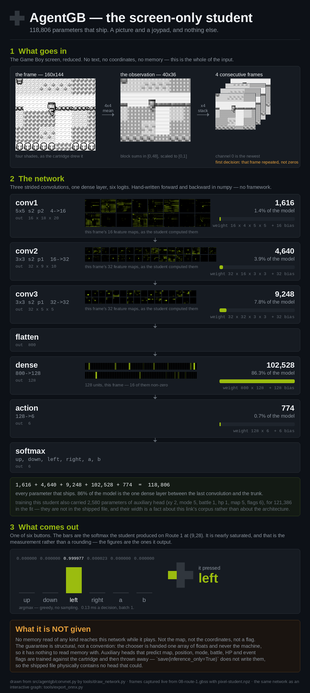

<section class="prose" markdown="1">

## Fourteen failures, one bug

A cold-boot chain scoring 594 of 600 looks, at a glance, like six runs that each went
slightly wrong in their own way — bad luck spread thin across six hundred attempts. It
wasn't. Three separate 600-run sweeps produced fourteen failures between them, and every
single one ended the same way: twelve identical actions in a row, the same button, right
up until the run ran out of decisions and was scored a loss.

The cause was the confidence gate the agent already relies on to act decisively. Above
0.80 confidence, it stops sampling and takes the argmax — the single most likely action,
no randomness. That's the right behaviour almost everywhere in the chain. It's the wrong
behaviour on a screen that a no-op cannot change: press a button that does nothing, the
frame stays exactly as it was, the network sees the same input it just saw, and produces
the same output. Confidence in the wrong button doesn't wobble. It locks, and there is
nothing in a static screen that can ever unlock it.

</section>

<section class="prose" markdown="1">

## Don't ban the action. Let the belief in it decay.

The obvious fix is a blocklist — once an action has done nothing N times running, take
it off the table. It works, and it's also exactly the kind of hard rule that breaks the
next time the situation looks a little different. The fix that shipped instead doesn't
forbid anything. It penalises belief.

Every time an action fires and the frame doesn't change, a flat amount is subtracted
from that action's logit — its pre-softmax score — before the next decision. Nothing
else on the board moves. The other five actions keep whatever scores the network gave
them; only the one that just proved it does nothing gets docked.

  
Exponential decay of belief.

  <cite>The framing is the captain's, and it is exact — not a metaphor</cite>

The exactness is in the arithmetic. Subtracting a flat amount *D* from a logit divides
that action's odds against every alternative by *e-D* on every repeat — the
same shape as an exponential backoff, arrived at from the opposite direction. A backoff
grows the wait after a failure; this shrinks the confidence after one. Repeat the no-op
enough times and the action that looked certain a moment ago stops being the argmax at
all, sampling opens back up, and the agent tries something else — not because it was
told to, but because it stopped believing the thing it was doing was working.

Whole-chain result: **594 of 600 to 600 of 600**. The specific failure mode the record
calls `stuck_in_battle` — an agent locked in a real fight, repeating an action combat
wasn't accepting — went from 4 occurrences to 0.

</section>

<section class="prose" markdown="1">

## The same machinery, pointed at healing

Once an agent can notice that repeating something isn't working, the next question is
obvious: can it notice a good reason to go do something else entirely, mid-chain,
without derailing the chain it's already following? The answer shipped the same day, as
a second mechanism: **chambered goals**.

A chambered goal has two conditions, decoupled in time. An *arm* condition, read from
cartridge memory — the agent has taken damage. A *fire* condition, read from the screen,
checked only once armed — the agent is looking at a Pokémon Center. Take damage, and the
chamber loads. Later, whenever a Center actually comes into view, it fires: walk in,
heal at the counter, walk back out, resume whatever the chain was already doing.

Satisfaction doesn't have to come from the direction the design expects. A blackout
heals the party too, so it discharges the chamber on its own, with no Center visit at
all — the condition the mechanism exists to detect stopped being true, and the mechanism
notices that as readily as it notices the Center. And because the fire condition's
recogniser is never even consulted while the chamber is unarmed, it is the least-exposed
recogniser anywhere in the system: arming isn't just a trigger, it's a safety property.
A screen can only fire this goal at the one moment the agent is actually carrying
damage.

Across the current 600-run certification, **306 runs** take that detour — walk to a
Center, heal, walk back out — mid-chain, at zero cost to the chain itself.

</section>

<figure class="pixel">
  
  <figcaption>
    The six-way head both mechanisms above operate against. Decay is a flat subtraction
    against one of these six bars, before the softmax is taken — nothing upstream of this
    layer changes, and nothing about the convolutions above it knows the subtraction
    happened.
  </figcaption>
</figure>

<section class="prose" markdown="1">

## How badly hurt he is decides how sure the recogniser has to be

A chambered goal still needs to know how confident is confident enough, and that
threshold isn't fixed. It's a gradient against how much the arm condition actually hurt:
barely scratched, the recogniser has to be almost certain the building in front of it is
a Center before it fires. Badly hurt, a glimpse is enough — the cost of a false negative
goes up as the party's health goes down.

Where that gradient's floor sits was measured, not guessed, one value at a time:

  <table>
    <thead>
      <tr><th>Confidence floor</th><th class="num">N</th><th class="num">Heals fired</th><th class="num">Chain result</th></tr>
    </thead>
    <tbody>
      <tr><td>0.945</td><td class="num">300</td><td class="num">96</td><td class="num">300/300</td></tr>
      <tr><td>0.94</td><td class="num">300</td><td class="num">100</td><td class="num">300/300</td></tr>
      <tr><td>0.93</td><td class="num">300</td><td class="num">131</td><td class="num">300/300</td></tr>
      <tr><td><strong>0.92</strong></td><td class="num">300</td><td class="num">152</td><td class="num"><strong>300/300</strong></td></tr>
      <tr><td>0.91</td><td class="num">600</td><td class="num">—</td><td class="num">599/600</td></tr>
    </tbody>
  </table>

0.92 is the measured last safe rung, and its margin is one notch: drop one more click to
0.91 and the chain loses a run it wasn't losing before. Every floor from 0.945 down to
0.92 fires more heals as it loosens and still lands the chain clean — the gradient buys
more coverage for free right up until the exact point it doesn't.

</section>

<section class="prose" markdown="1">

## The honest bits

The gradient shipped in its measured, governed form. It didn't start there. The first
version of the confidence threshold was tuned too hot — loose enough that the recogniser
it gated fired **13,673 times** over the course of testing it, and five runs got trapped
standing at a door, chambering and re-chambering a heal that kept almost-firing. At the
floor that actually shipped, 0.92, the same recogniser fires 591 times. The difference
between those two numbers is the entire reason the floor sweep above exists instead of a
single value picked once and trusted.

A separate change tried to make the Center recogniser more precise by narrowing what it
was allowed to look at — cropping the frame down to just the POKé sign over the door,
instead of the wider shot that includes the building around it. It scored worse: 77.7%
against the wider crop's 79.6%. The pixel observation the tighter crop produced was
correct; the classifier simply had less to work with than the wider one gave it. That
result didn't get deleted for not helping. It's in the record as a negative, because the
next person tempted to crop tighter for the same reason should be able to find out it
already didn't work.

And once, earlier in this same stretch of work, a chain got certified, reported and
merged while four of the weight files it depended on existed only in a scratch folder —
real on the machine that ran the certification, absent from everything committed. The
build didn't catch it because nothing was checking. It does now:
`tools/test_studentconfig_guards.py` test 10 fails the build if any registered goal
points at a path that isn't tracked.

</section>
