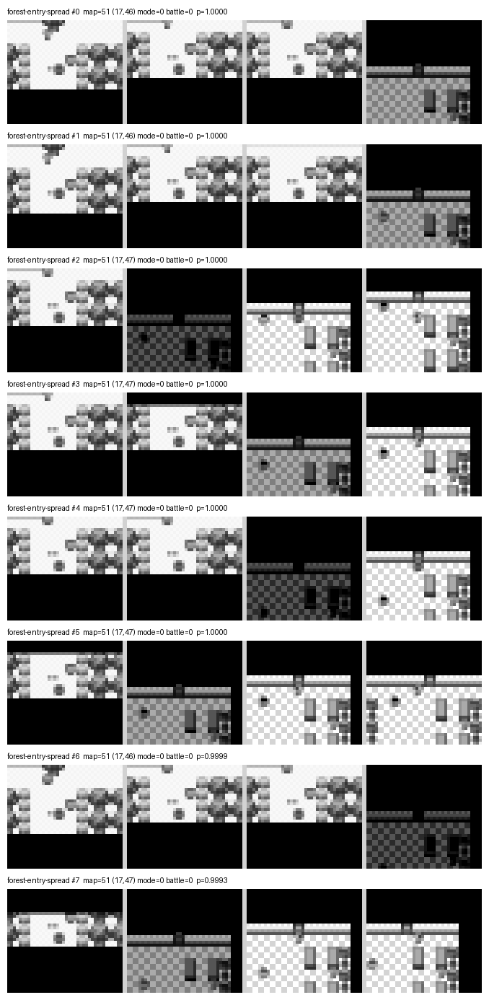
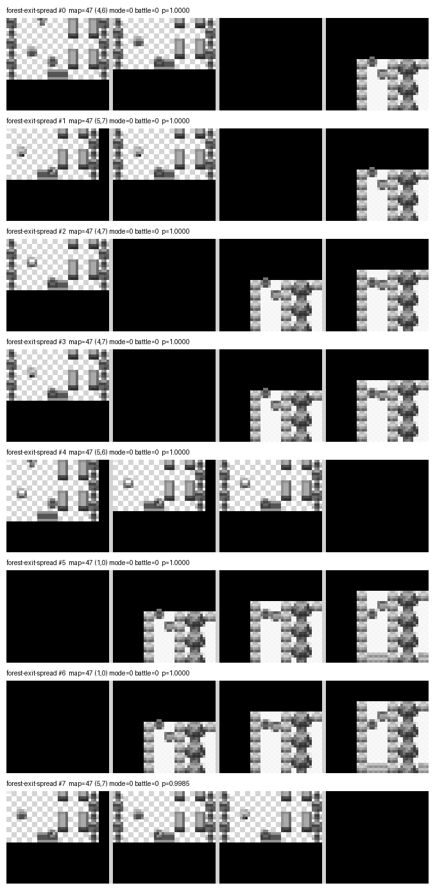
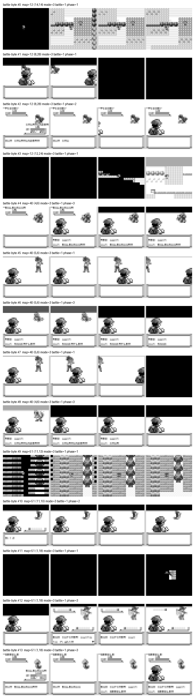
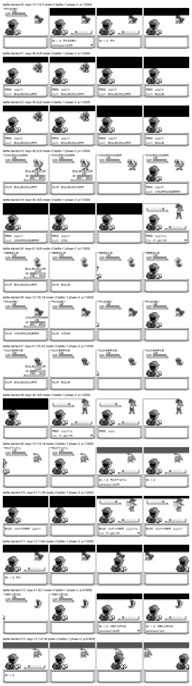
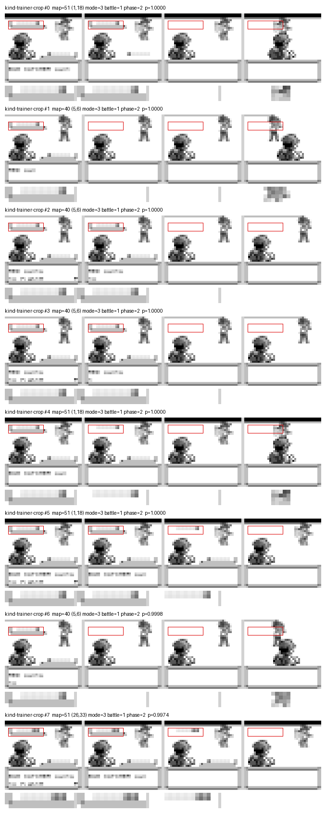
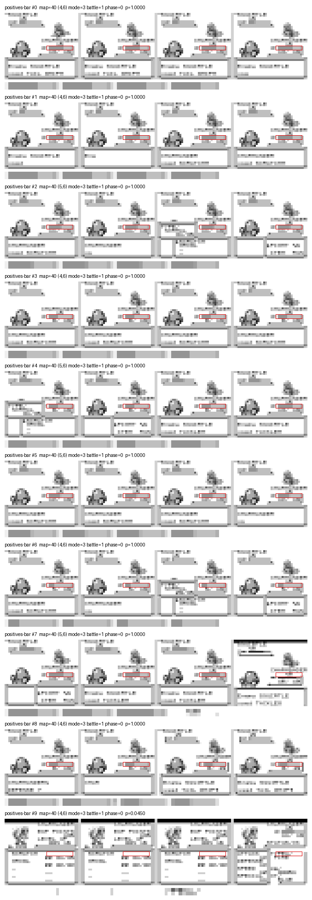

<section class="prose" markdown="1">

The student plays from four stacked 36&times;40 greyscale frames in, one of six buttons
out. That constraint is the whole point of the project, and for months the scaffolding
around the student quietly broke it.

The scaffolding is a set of small triggers — *a battle has started*, *this is the
forest*, *our lead is hurt* — that decide which trained behaviour drives the next
decision. Each one used to answer its question by reading the cartridge: `wCurMap` for
the forest, `wIsInBattle` for the battle, the party HP struct for the heal. Point it at
a different emulator and none of those reads exist.

Over two days, 2026-09-02 and 03, five of them were replaced with networks that look at
the picture. Every one of the five was harder than it looked, and the ways they went
wrong are more useful than the fact they now work.

</section>

<section class="prose" markdown="1">

## What a recogniser is

A recogniser is the smallest thing this project trains. Two classes, one question — *is
this the screen?* — over the same observation the student gets, or a crop of it. You
give it a pile of frames that are the scene, a pile that are not, and hold some back to
score it on.

Size follows the crop, and the crop matters more than anything else here. A full-frame
recogniser is 118,290 parameters. Cropped to the band under the opponent's name it is
28,178; to the lead's HP bar, 24,082; to the top half of a text box, 6,954.

None of them touch the student. `models/pixel-student.npz` is 122,330 parameters and was
not retrained once during any of this — same file, sha256 `b2bb79082c88c486…`, before
and after.

</section>

<section class="prose" markdown="1">

## Held-out accuracy lies

The first forest attempt was a single classifier for *is this Viridian Forest*. It
scored **1.0000** balanced accuracy on frames it had never seen, and then fired on **37%
of 1,705,090 real play frames**. Raising the bar did not save it: 15.5% still fired at
0.999.

This is structural, not bad luck. A closed two-class network puts everything it has
never seen into whichever class is broader, and the held-out split is drawn from the
frames it *was* shown — so it cannot contain the failure by construction. For a question
like "which place is this", the broader class is the positive one, and the recogniser
converges on *yes*.

The fix is not a better classifier. It is a different question. A place is a scene, and
a scene has no edges. A doorway is an event, and an event has a beginning. Recognise the
event.

</section>

<section class="prose" markdown="1">

## The probe lies too

So you probe: run the trained recogniser over every corpus on disk and count how often
it fires where it should be silent. The forest-entry trigger came back with **zero false
alarms across 1,705,090 frames of 19 links**.

It then fired inside the player's own house, at p &gt;= 0.999, in **19 of 20 live
cold-boot runs**. Because that goal holds until an exit trigger clears it, one such fire
strands the run for good: a paired N=20 read 0/20 against 11/20 for the version it was
replacing.

Both numbers were correct. A link's corpus *stops* at its map change, because that is
when its goal fires, and the next link's corpus *starts* after it. The cross-map stack —
three frames of the old room, one of the new — is exactly what a door produces and
exactly what this recogniser was trained on, and it exists in no ordinary corpus at all.

A check cannot find a fault in a place it was never shown. Anything whose subject is a
transition has been measured against data that structurally cannot contain its worst
confusion. The repair was a shard of 4,825 cross-map door fades from six other doors in
the opening chain, collected on purpose and used as a probe target.

</section>

<section class="prose" markdown="1">

## The stack drags the last room in with it

<figure class="pixel">
  
  <figcaption>
    Eight rows sampled across the forest-entry positives. Each row is one decision's four
    stacked frames, newest on the left. The left frames are forest; the right frames are
    the gatehouse interior the player just walked out of.
  </figcaption>
</figure>

Look at the right-hand frames. They are indoors.

The observation is four frames, so "the first frame of the forest" physically carries
three frames of the room before it. Measured on the crossing shard: of 600 rows labelled
map 51, the oldest channel is the gatehouse in **450**, and only **150** are forest in
all four. Three quarters of what the first recogniser was taught to call *forest entry*
was mostly indoor-building pixels — which is precisely why it fired in a house.

The fix is to keep only frames whose four channels are all the target map. Three steps
into the forest is the first decision with no gatehouse anywhere in the stack, and
across 150 runs it produces just four distinct pictures. That is a fixed shot, not a
spread, which is what makes it worth recognising.

The exit is the same trick pointed the other way — the north door, on the way out.

<figure class="pixel">
  
  <figcaption>
    The forest exit spread: eight decisions at the north door.
  </figcaption>
</figure>

Its threshold is 0.99, not the 0.999 the entry uses, and the difference was measured
rather than chosen. At 0.999 the exit misses 37 of 152 real exits. A trigger tuned only
for silence goes blind; this project has already lost 11 of 27 runs to one that only
ever saw a fully drawn line of text.

</section>

<section class="prose" markdown="1">

## A screen-only trigger, taught by a memory read

This is the one worth the whole page.

The battle gate was trained on every frame where the cartridge byte `wIsInBattle` said a
battle was happening — `--positive-select "battle=1"`. It reads nothing but pixels when
it plays. Its positives were chosen by reading memory.

The byte and the screen do not agree. On a wild encounter the byte flips a decision
*before* the screen changes; on a trainer battle it flips about six decisions *after*
the entry wipe has started. So the pile contains frames that are not battle screens.

  <figure class="pixel">
    
Chosen by the byte · poisoned

    
    <figcaption>
      Row 0 is the overworld — grass, a ledge, the player. Rows 1, 3, 7 and 11 are the
      screen wiping to black. Every one of these was labelled <em>a battle is on
      screen</em>.
    </figcaption>
  </figure>
  <figure class="pixel">
    
Chosen by the phase · honest

    
    <figcaption>
      The same gate's positives after the fix, selected on the announcement frames instead
      of the byte. Same pile, same shape, no black frames anywhere in it.
    </figcaption>
  </figure>

Across the whole pile: **1,572 of 3,632** selected rows are the entry wipe, and **1,130
of them — 31.1% — contain at least one entirely black frame**. The gate was being taught
that *a battle is on screen* includes *the screen is black*, which is also every door
fade in the game.

The numbers never showed it. Held-out balanced accuracy 1.0000, every one of 227 genuine
battles caught at every threshold, and a stubborn floor of a handful of false alarms per
half-million frames that four rounds of patching, a wider patch budget and more epochs
all failed to move: 8, then 2, then 5, on different links each time. Not a threshold
problem, not a capacity problem. The label.

The repair was a new per-frame field recorded at collection time, marking the first run
of decisions after a battle begins on which the game has something to say — `<NAME>
wants to fight!` for a trainer, `Wild <SPECIES> appeared!` for an encounter. One rule,
symmetric, nothing to edit as the game world grows.

Honest labels: 2,060 rows, **zero** containing a black frame. That took the gate from
*refused after four rounds of patching* to passing with no patched negatives at all —
**0 false alarms in 549,918 frames at 0.999**, all 227 battles still caught.

There is a cost. The gate is now shut during the entry wipe, so the battle pair does not
take the wheel for those few decisions. That is the right answer: nothing on screen says
*battle* yet, and a gate that opened on a black screen would open on every door in
Kanto.

This generalises. Every screen recogniser in this project selects its positives on a
cartridge label. Where the label and the picture agree frame for frame that is free.
Where they can disagree — a transition, a fade, a warp, a battle start — the bug is
waiting, and nothing on the training side can see it, because the network learns the
wrong label perfectly.

</section>

<section class="prose" markdown="1">

## Crop to the thing itself

Telling a trainer battle from a wild one by sight comes down to one band of the screen.
A trainer's party is drawn as a row of Pok&eacute; Balls under their name while the
challenge line is up. A wild encounter never draws one.

<figure class="pixel">
  
  <figcaption>
    The trainer-kind positives. Each row shows the four-frame stack with the crop outlined
    in red, and beneath it the same band blown up — all the network is handed.
  </figcaption>
</figure>

Two decisions later the row is gone and the same band carries the enemy HP bar, which
reads identically in both kinds of fight. The signal exists only at the start: 346 of
346 recorded trainer battles show it, for a median of 2 decisions, range 2 to 2.

Cropped to that band, the recogniser fires on **0 of 1,019,244** probed frames at 0.95
while catching all 346 — and the probe deliberately includes three wild-battle corpora,
where a fire would be a real mistake rather than an unseen scene.

The same argument, put more sharply, produced the heal trigger. The design note is worth
quoting:

  

    A declared region is a hard, structural restriction on what a recogniser can see, not
    a hope that a balanced corpus will make it ignore the rest.
  

  <cite>The heal trigger's design note</cite>

<figure class="pixel">
  
  <figcaption>
    The lead's HP bar, outlined in red on each frame of the stack, with the crop itself
    beneath. The Pok&eacute;mon's name, the <code>HP:</code> label and the digits all sit
    outside the box.
  </figcaption>
</figure>

That crop is 24,082 parameters and cannot see the name or the level, by construction
rather than by hoping.

It also cannot be trusted on its own. Ungated, it reads **33% of 1,898,768 real play
frames** as *low HP* — every one an overworld frame whose bar region is a patch of
grass. The HP bar is only drawn during a battle, so the bar reading is only ever taken
inside the battle gate above. Gated, twelve of twenty-four probe links contribute no
frames at all, because none of them contains a battle.

Gated and measured against frames whose recorded HP already settles the answer: **42
false alarms in 71,482 frames across 24 links, 0.059%, with 1,035 of 1,035 genuine
occurrences caught.**

One thing that measured worse is worth the space, because it points the other way.
Looking at the pile showed **84.1% of its 67,935 positives were gate-shut** — the intro
wipe, the stats sub-screen, the move list, none of them drawing a bar at all. Cutting
them is obviously the right thing to do. Paired at the same seed and epochs, it takes
held-out accuracy *up*, 0.9946 to 0.9997, and the false-alarm rate on the frames the
trigger will really be asked about the *wrong way*, 0.48% to 1.73%. Held-out accuracy
lied about the fix for held-out accuracy lying.

</section>

<section class="prose" markdown="1">

## A trigger that holds must latch

The battle pair does not just fire; it holds the wheel until the fight ends. The first
wiring asked the entry recogniser again every decision.

That cost the chain 9/30 down to 2/30. The rival fight fell to 19/30 and eleven runs of
thirty ran out their budget standing in Oak's lab.

The reason, measured over real fights: the gate reads under its own entry bar on a large
minority of a battle's frames — the attack flash, the move menu, the damage animation.
Over 20,000 sampled battle frames it clears 0.999 on **31.4%** of them in the rival
fight and 41.6% on Route 1. Swept all the way down to 0.005, only 79–95% clear the bar;
there is a hard core it reads as near-zero at any threshold. Its longest run of readings
below 0.5 *while the battle is genuinely still on* is a median of 5 to 9 and a **maximum
of 16 consecutive decisions**, which no single-frame bar can tell apart from a real
ending.

So the marker fires once, latches, holds, and is released by a separate condition. Three
changes, no retraining and no new weights: a latched group keeps the wheel whatever the
gate currently reads; the release has to disagree 24 decisions running, half again
beyond the worst observed 16; and entry and release are different numbers, 0.999 and
0.5. Using one number for both is what caused it.

The rival fight went back to 30/30 and `stuck_in_battle` from 26 to 1.

The entry recogniser only has to be good at the entry frame. It already was.

</section>

<section class="prose" markdown="1">

## What actually worked

**Crop tight.** Every trigger cropped to a band — the text box, the ball row, the HP bar
— passed on the first or second attempt. The two aimed at whole screens fought back for
a night each.

**Prefer the game's own words.** Where the cartridge announces something out loud, match
the text and train nothing. The heal cycle disarms on Nurse Joy saying `fightin` — a
seven-character prefix, chosen so it catches the line while it is still being drawn, and
chosen over `Thank you!` because the shop clerk says that too.

**Train simple, probe broad, patch narrow.** Start with the scene's own non-scene frames
as the negative class and nothing else. Probe everywhere. Add only the areas measured to
be confused. The alternative is mapping the entire game as *no*.

**Refuse.** If no threshold satisfies both bars, ship nothing.

</section>

<section class="prose" markdown="1">

## Where it stands

Nothing in the config the student now runs reads cartridge memory. Of its twelve goals,
eleven fire from pixels through a recogniser and one fires on a line the game prints on
screen; two of the eleven also stand down on a printed line. No map reads, no battle
byte, no HP struct.

The forest crossing over the two days, all N=30 cold boots on the same config, seed 42:

<table>
  <thead>
    <tr>
      <th>Change</th>
      <th class="num">Crossings</th>
    </tr>
  </thead>
  <tbody>
    <tr><td>forest trigger on the screen, hold evicted by other goals</td><td class="num">0/30</td></tr>
    <tr><td>hold made to survive another goal's decision</td><td class="num">4/30</td></tr>
    <tr><td>heal trigger rebuilt, having fired 383 times inside the forest</td><td class="num">9/30</td></tr>
    <tr><td>battle triggers on the screen, hold re-checked every frame</td><td class="num">2/30</td></tr>
    <tr><td>battle triggers latched</td><td class="num">8/30</td></tr>
    <tr><td><strong>heal chamber moved to the HP bar</strong></td><td class="num"><strong>12/30</strong></td></tr>
  </tbody>
</table>

The last row carries its own caveat: paired over the same 30 seeds the heal change
gained 8 runs and lost 4, which at this sample size is not a proven improvement (McNemar
exact p=0.39). What it did establish is that the trigger now fires when it should —
`go-heal-center` went from firing in 20 of 30 episodes to 29, and every one of those 29
ended at Viridian's own counter.

The third row is the one to notice. A trigger firing where it should not does not just
misbehave locally — the heal trigger was firing 383 times inside Viridian Forest, a room
with no Pok&eacute;mon Centre counter in it, and evicting the forest walking lesson 22
times. It was the single largest cause of the crossing failing, and the fix was in a
different goal entirely.

And the honest comparison: the same 25-link config with all five cartridge reads still
in place crossed the forest in **41 of 60** agents. Screen-only currently costs ground.

That is not a like-for-like measurement — 60 agents against 30 runs, and the two seed
their attempts differently — so read the direction and not the size. The direction is
clear enough, and it is the price of the constraint rather than an argument against it.
A trigger that reads the cartridge cannot leave the building.

Every figure here is N=30 or smaller against a project convention of 3,000 attempts.
These are screens, not certifications.

</section>

<section class="prose" markdown="1">

## One command

All of this is now `agentgb trainscene`: select the positives, train, probe real play,
sweep the threshold on both sides, and print a registry entry — or refuse.

It refuses by default if a trigger fires even once where it should be silent, because a
trigger behind a hold strands the whole run on a single false positive. It refuses if
any genuine occurrence is missed, counting occurrences as episodes rather than frames,
so a long fully drawn tail cannot carry a trigger that misses every half-drawn entry.

It refuses in practice and not only in principle. The first trigger it was ever pointed
at in anger — the Pok&eacute;mon Centre counter — came back refused on round one, with
21 of 22 probed areas firing.

Rebuilding the forest-entry trigger with it, natural negatives alone: held-out balanced
accuracy 1.0000, and 21,295 false alarms in 1,751,142 frames, 1.2% even at 0.999.
Refused, with 21 of the 23 probed areas named and the flag to paste back printed
underneath. With those negatives added: **zero false alarms at every threshold from 0.8
to 0.999, all 150 crossings still caught**, the weakest at p=0.999974. Three and a half
minutes.

The other half is not a command. Dump the positives, look at the montage, and ask
whether every row is the thing you meant. It has now caught three poisoned piles where
every number said clean, and a person spotted each of them by eye.

</section>
