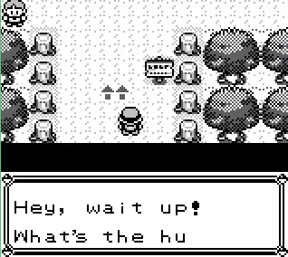
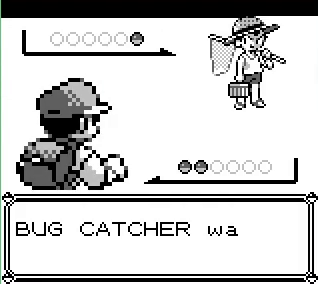

<section class="prose" markdown="1">

  measured
  inferred

**Measured** is a byte read out of a saved state or a field read out of a run record.
**Inferred** is reasoning from one of those to something we did not read. Prior community
work is named where it appears.

</section>

<section class="prose" markdown="1">

## Nine decisions

He crosses from the Viridian Forest south gate into the forest on decision 4094 and lands on
tile (17,47). The emulator's own map data lists that tile as one of four exits back to the
gate he just came through — it is the doorway.

He never leaves it. Two decisions later a text box opens: *Hey, wait up! What's the hurry?*
Four decisions after that the screen goes to the battle wipe, and on decision 4103 he is in
a fight. Between crossing the boundary and the fight he pressed `up`, `a`, `up`, `b`, `up`,
`b`, `up`, `a`, `a`, and his coordinates did not change once.

</section>

<figure class="clip-auto" style="max-width:640px;margin-inline:auto;">
  <video muted loop autoplay playsinline preload="metadata"
         poster="../assets/img/agentgb/forest-doorway-poster.png"
         width="636" height="568">
    <source src="../assets/video/agentgb/forest-doorway-battle.mp4" type="video/mp4">
  </video>
  
  <figcaption>
    Eleven seconds cut from the swarm film, cropped to the first of its six tiles, at the
    film's own eightfold speed and otherwise untouched. Route 2, the gate, the forest, and
    the fight — then he wins it, and it starts again.
  </figcaption>
</figure>

<section class="prose" markdown="1">

  <figure class="pixel">
    
Decision 4096&ndash;4098 &middot; on the doorway tile

    
    <figcaption>Two decisions after crossing the boundary. He has not moved.</figcaption>
  </figure>
  <figure class="pixel">
    
Decision 4108 &middot; the fight

    
    <figcaption>A trainer battle, on the tile the map uses as its own front door.</figcaption>
  </figure>

</section>

<section class="prose" markdown="1">

## It is a trainer, and the cartridge says so

measured
Read at decision 4110: `wIsInBattle` (`$D057`) is **2**, which the atlas names as a trainer
battle and not a wild one. `wCurOpponent` (`$D059`) is **202** — at or above 200 it is a
trainer class plus that offset, so class 2, a Bug Catcher. `wTrainerClass` (`$D031`) is **2**
and agrees. The opponent is a WEEDLE at level 9.

There is nowhere for a Bug Catcher to be standing. The doorway tile is an exit; the fight
started with the player one tile inside a map he had entered nine decisions earlier, and
forty-five tiles — sixteen columns and twenty-nine rows — from where he last fainted.

</section>

<section class="prose" markdown="1">

## The same tile, one visit earlier

This was his third visit to Viridian Forest. On the second he crossed the same boundary and
stood on the same tile (17,47) for two decisions and walked on. Nothing happened. His first
battle of that visit came ninety-eight decisions later, at (6,12), and it was wild.

Between the second visit and the third, one thing happened to him.

<table>
  <thead>
    <tr>
      <th>Decision</th>
      <th>Map</th>
      <th class="num">Tile</th>
      <th>Screen</th>
      <th><code>$D057</code></th>
      <th><code>$D059</code></th>
      <th><code>$D618</code></th>
      <th>Pressed</th>
    </tr>
  </thead>
  <tbody>
    <tr><td>3303</td><td>Viridian Forest</td><td class="num">(17,47)</td><td>walking in, visit two</td><td>none</td><td class="num">0</td><td class="num">0</td><td><code>a</code></td></tr>
    <tr><td>3634</td><td>Viridian Forest</td><td class="num">(1,18)</td><td>a wild CATERPIE, level 4</td><td>wild</td><td class="num">0</td><td class="num">0</td><td><code>up</code></td></tr>
    <tr><td>3708</td><td>Viridian Forest</td><td class="num">(1,18)</td><td><em>BLUE blacked out!</em></td><td>wild</td><td class="num">0</td><td class="num">0</td><td><code>a</code></td></tr>
    <tr><td><strong>3709</strong></td><td>Viridian Forest</td><td class="num">(1,18)</td><td>the warp</td><td><strong>blacked-out</strong></td><td class="num">0</td><td class="num">0</td><td><code>a</code></td></tr>
    <tr><td><strong>3711</strong></td><td>Viridian Forest</td><td class="num">(1,18)</td><td>the warp</td><td>blacked-out</td><td class="num">0</td><td class="num"><strong>1</strong></td><td><code>a</code></td></tr>
    <tr><td>3714</td><td>Viridian City</td><td class="num">(23,26)</td><td>awake, 24/24</td><td>none</td><td class="num">0</td><td class="num">1</td><td><code>a</code></td></tr>
    <tr><td>4088</td><td>Forest south gate</td><td class="num">(5,6)</td><td>walking back up</td><td>none</td><td class="num">0</td><td class="num">1</td><td><code>up</code></td></tr>
    <tr><td>4094</td><td>Viridian Forest</td><td class="num">(17,47)</td><td>crossing in, visit three</td><td>none</td><td class="num">0</td><td class="num">1</td><td><code>up</code></td></tr>
    <tr><td>4098</td><td>Viridian Forest</td><td class="num">(17,47)</td><td><em>Hey, wait up!</em></td><td>none</td><td class="num">0</td><td class="num">1</td><td><code>up</code></td></tr>
    <tr><td><strong>4110</strong></td><td>Viridian Forest</td><td class="num">(17,47)</td><td>WEEDLE Lv9</td><td><strong>trainer</strong></td><td class="num"><strong>202</strong></td><td class="num"><strong>4</strong></td><td><code>a</code></td></tr>
  </tbody>
</table>

measured
`$D618` is `wViridianForestCurScript` — how far through Viridian Forest's own map script the
game is. It is 0 on both earlier visits, goes to 1 two decisions into the blackout, stays 1
through the warp, the Pokémon Center, Route 2 and the gate, and is still 1 when he steps back
onto the doorway tile. The battle takes it to 4.

</section>

<section class="prose" markdown="1">

## What survived the blackout

Comparing the same eight bytes at four moments answers which of them carries the fight across.

<table>
  <thead>
    <tr>
      <th>Address &middot; symbol</th>
      <th class="num">Walking, d3630</th>
      <th class="num">Blacked out, d3709</th>
      <th class="num">Awake, d3718</th>
      <th class="num">At the door, d4098</th>
    </tr>
  </thead>
  <tbody>
    <tr><td><code>$CD60</code> <code>wMiscFlags</code> bit 0</td><td class="num">0</td><td class="num"><strong>1</strong></td><td class="num">0</td><td class="num">0</td></tr>
    <tr><td><code>$CD2D</code> <code>wEngagedTrainerClass</code></td><td class="num">6</td><td class="num"><strong>202</strong></td><td class="num">202</td><td class="num">7</td></tr>
    <tr><td><code>$CD2E</code> <code>wEngagedTrainerSet</code></td><td class="num">7</td><td class="num"><strong>3</strong></td><td class="num">3</td><td class="num">7</td></tr>
    <tr><td><code>$CF13</code> <code>wSpriteIndex</code></td><td class="num">0</td><td class="num"><strong>4</strong></td><td class="num">4</td><td class="num"><strong>4</strong></td></tr>
    <tr><td><code>$CC55</code> <code>wTrainerHeaderFlagBit</code></td><td class="num">0</td><td class="num"><strong>4</strong></td><td class="num">4</td><td class="num"><strong>4</strong></td></tr>
    <tr><td><code>$DA30</code> <code>wTrainerHeaderPtr</code></td><td class="num">$6651</td><td class="num"><strong>$5A51</strong></td><td class="num">$5A51</td><td class="num"><strong>$5A51</strong></td></tr>
    <tr><td><code>$D618</code> <code>wViridianForestCurScript</code></td><td class="num">0</td><td class="num">0 &rarr; <strong>1</strong></td><td class="num">1</td><td class="num"><strong>1</strong></td></tr>
    <tr><td><code>$DA39</code> <code>wCurMapScript</code></td><td class="num">0</td><td class="num">0 &rarr; <strong>1</strong></td><td class="num">1</td><td class="num"><strong>1</strong></td></tr>
  </tbody>
</table>

measured
Every one of those bytes is 0, or holds an unrelated value, on the last decision of the wild
battle. They are set on the next one — the decision the cartridge writes `$FF` into
`wIsInBattle`, which the atlas names as *the player blacked out* and which is not a battle.
`wEngagedTrainerClass` reads 202 and `wEngagedTrainerSet` reads 3 — a Bug Catcher, roster
three — and the fight that started at the door was a Bug Catcher leading a level 9 WEEDLE.

`$CD60` bit 0 — the flag that says a trainer has spotted the player — is cleared by the time
he is awake in Viridian City. So is the engaged-trainer pair, by the time he reaches the
gate. What is not cleared is the map's own script index, and the sprite slot and header
pointer that tell that script which trainer it is about to run. Viridian Forest's script is
left at step 1, which is *a trainer is waiting to fight you*, and the map runs it the moment
the map is loaded again.

  
The blackout put him a town away and healed his party. It did not put the forest back
  the way it found it.

inferred
Sprite slot 4's stored map coordinates read 22 and 6, and under Gen 1's four-tile bias on
sprite coordinates that is tile (2,18) — one step east of (1,18), where he fainted. That is
consistent with a Bug Catcher standing directly beside him at the moment the wild encounter
started, and it is an inference from the sprite table, not a reading of the trainer's tile.

</section>

<section class="prose" markdown="1">

## This one has a name, and it is not ours

The community found and documented this long before we walked into it. It is the **trainer
escape glitch**, also called trainer-Fly, and the variant we hit is the death-warp one:
faint to a wild encounter inside a trainer's field of vision, and, in the Glitch City Wiki's
words, *"the trainer will notice the player on that frame, advancing the meta-map script ID
just before the player warps away."* Returning to the map gives an instant encounter. The
same wiki page names `$CD60` bit 0 as the byte set when a trainer spots the player, which is
the byte our own read agrees with.

Its wider significance is theirs too. Escaping a trainer battle rather than blacking out is
what makes the glitch dangerous: it leaves an encounter staged from stale battle memory, and
that is the foundation of the Mew glitch and a component of the arbitrary-code-execution
routes speedrunners use in Red and Blue.

What we hit is the tame end of it. Our student blacked out rather than escaping, so the
cartridge staged a real Bug Catcher with a real WEEDLE rather than a corrupted one, and
nothing about the run afterwards is corrupt. The interesting part is not the mechanism.
It is that an agent nobody told about any of this walked into it on its own, and that we can
put a rate on it.

</section>

<section class="prose" markdown="1">

## How often it happens to us

Every trainer battle a run starts in Viridian Forest is logged with the tile the player was
standing on. Across every recorded episode we hold, those tiles cluster hard.

<table>
  <thead>
    <tr><th class="num">Tile</th><th class="num">Trainer battles started there</th><th>What it is</th></tr>
  </thead>
  <tbody>
    <tr><td class="num">(1,18)</td><td class="num">672</td><td>Inside the forest</td></tr>
    <tr><td class="num">(26,33)</td><td class="num">157</td><td>Inside the forest</td></tr>
    <tr><td class="num">(27,33)</td><td class="num">28</td><td>Inside the forest</td></tr>
    <tr><td class="num"><strong>(17,47)</strong></td><td class="num"><strong>21</strong></td><td><strong>A south-gate exit tile</strong></td></tr>
    <tr><td class="num">(26,19)</td><td class="num">7</td><td>Inside the forest</td></tr>
    <tr><td class="num">(27,30)</td><td class="num">3</td><td>Inside the forest</td></tr>
    <tr><td class="num">(2,19)</td><td class="num">3</td><td>Inside the forest</td></tr>
  </tbody>
</table>

One row is a tile you cannot fight anybody on. Following it out:

<table>
  <thead>
    <tr><th>Population</th><th class="num">Runs</th><th class="num">Doorway battle</th><th class="num">Finished the chain</th></tr>
  </thead>
  <tbody>
    <tr><td>Every recorded episode we hold</td><td class="num">44,706</td><td class="num">—</td><td class="num">—</td></tr>
    <tr><td>&hellip; of those, runs whose goal set can detect it</td><td class="num">11,927</td><td class="num"><strong>32</strong></td><td class="num"><strong>0</strong></td></tr>
    <tr><td>&hellip; spanning distinct seeds</td><td class="num">625</td><td class="num"><strong>1</strong></td><td class="num">—</td></tr>
    <tr><td>The six paired sweeps of 7 Sep 2026</td><td class="num">390</td><td class="num">6</td><td class="num">0</td></tr>
  </tbody>
</table>

measured
Thirty-two recorded runs across five separate run roots start a trainer battle on a Viridian
Forest exit tile. Every one of the thirty-two is seed **4200126**. None of the thirty-two
finished the chain.

That seed has been re-run under six different goal configurations in one day, scoring
between 91 and 96 whole chains out of 100 between them, and it failed in all six. Only one
other seed in the hundred does that. Changing what the student believes about battle screens,
about items, about catching, does not touch this one, because none of it is about the
student.

</section>

<section class="prose" markdown="1">

## What it cost him

He won the forced battle on decision 4251. Three decisions later, on the same tile, *BUG
CATCHER wants to fight!* again, and the same level 9 WEEDLE. That fight ran to 4377.

Then the run stops being a run.

<table>
  <thead>
    <tr>
      <th>Visit to Viridian Forest</th>
      <th class="num">Decisions inside</th>
      <th class="num">Distinct tiles</th>
      <th class="num">Furthest north</th>
    </tr>
  </thead>
  <tbody>
    <tr><td>One — decisions 2733&ndash;3086</td><td class="num">353</td><td class="num">111</td><td class="num">row 3</td></tr>
    <tr><td>Two — decisions 3302&ndash;3709</td><td class="num">407</td><td class="num">116</td><td class="num">row 3</td></tr>
    <tr><td><strong>Three — decisions 4094&ndash;8660</strong></td><td class="num"><strong>4,566</strong></td><td class="num"><strong>28</strong></td><td class="num"><strong>row 35</strong></td></tr>
  </tbody>
</table>

The exit he needs is on row 0. On his first two visits he reached row 3, twice, having walked
over a hundred distinct tiles each time. On the third he walked twenty-eight, never got above
row 35, entered no battle at all after the two at the door, pressed `down` 2,358 times, and
ran out of budget at (16,38) with the gate goal still latched: the goal that walks him back
towards the door he came in through.

</section>

<section class="prose" markdown="1">

## What we cannot say from this recording

<ul class="gaps">
  <li>
    <b>When the sight line actually fired.</b> Every trainer byte is clear on decision 3708,
    the decision that prints <em>BLUE blacked out!</em>, and set on 3709. One decision is
    thirty-two emulator frames, so this recording cannot separate <em>the trainer noticed him
    as the wild battle began and the write happened later</em> from <em>the trainer noticed
    him as the battle ended</em>. The community describes the first; we measured the write,
    not the notice.
  </li>
  <li>
    <b>Which trainer the second battle was.</b> No state was saved inside it. It was a Bug
    Catcher with a level 9 WEEDLE, from the screen, and that is as far as our recording goes.
  </li>
  <li>
    <b>How many other runs black out inside Viridian Forest.</b> Answering that needs
    per-decision traces for episodes we only hold summaries of. The doorway signature above
    is what the recorded data can carry on its own, and it is a lower bound: a run that hit
    the same fault and then died before the goal fired would not appear in it.
  </li>
  <li>
    <b><code>wTrainerNo</code> (<code>$D05D</code>) proves nothing here.</b> It reads 3 from
    the first probe to the last and never changes, so its agreeing with roster three is a
    coincidence, not evidence. The identity comes from <code>wEngagedTrainerSet</code>, which
    changed.
  </li>
</ul>

</section>

<section class="prose" markdown="1">

## What it changes

For the student: nothing to fix. He walked a legal route, took a legal encounter, lost it,
and was warped away by the game's own rules. Everything after that was the cartridge running
a script it should have reset. There is no observation he could have made and no button he
could have pressed that would have avoided the second battle, because the fight was already
staged before the map was drawn.

For us it changes how one number should be read. Every recorded run of seed 4200126 that reaches the
doorway battle fails, thirty-two out of thirty-two, and each one has been counted as one more
run that got confused in the forest. It is not that. It is one run that met a
documented fault in Pokémon Blue, and none of the six configurations tried on it so far makes
any difference, because none of them is about the cartridge. A 96-out-of-100 with this seed
inside it is really a 96 out of 99 plus one cartridge bug, and the honest way to report a
sweep is to say which of its failures are the agent's.

It also raises the price of a blackout. The healing chamber added last week treats a faint as
a cost in decisions — you lose the walk back. It is not only that. Faint on the wrong tile
and the map keeps a fight for you, and it will be waiting at the door.

</section>
