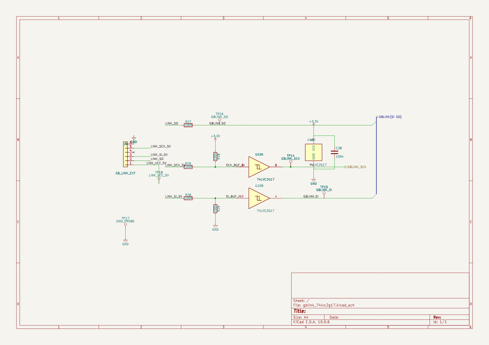
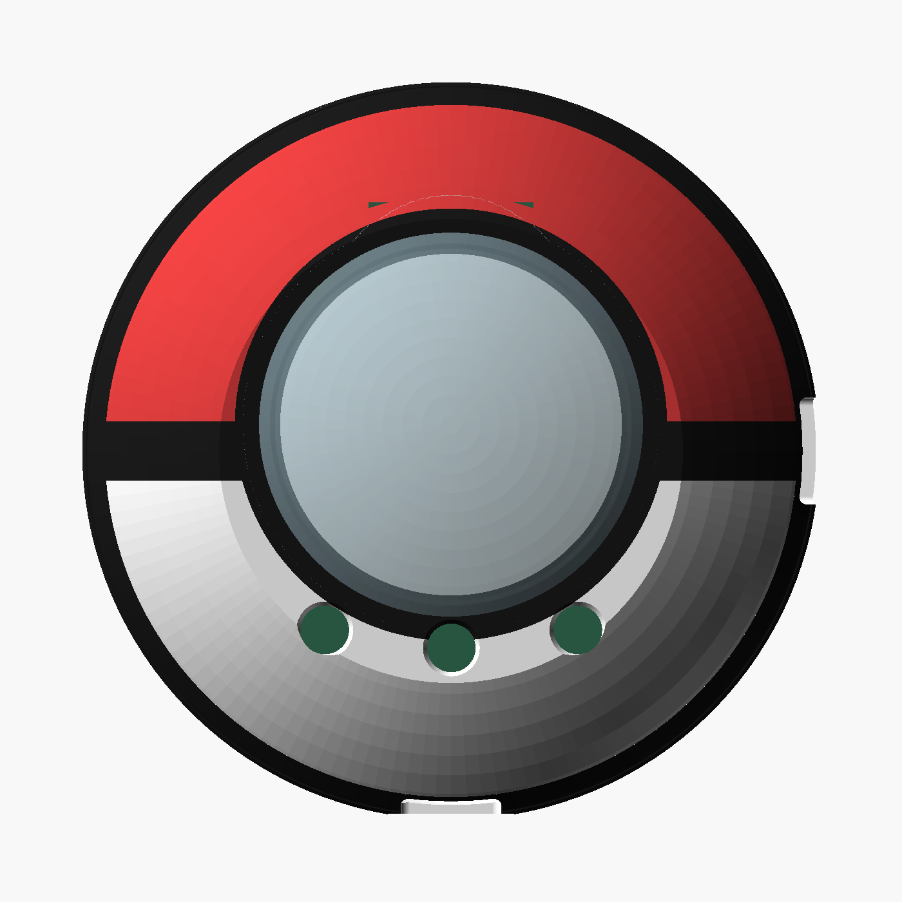
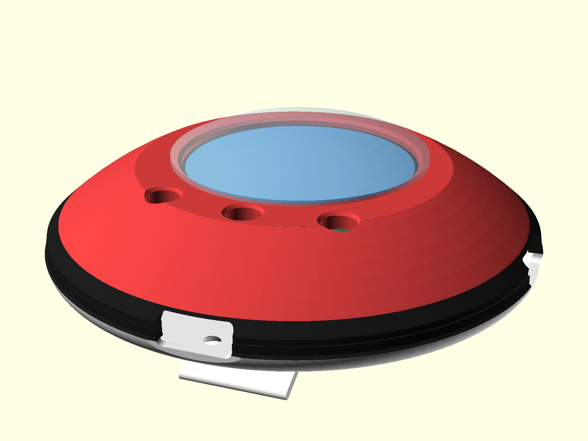
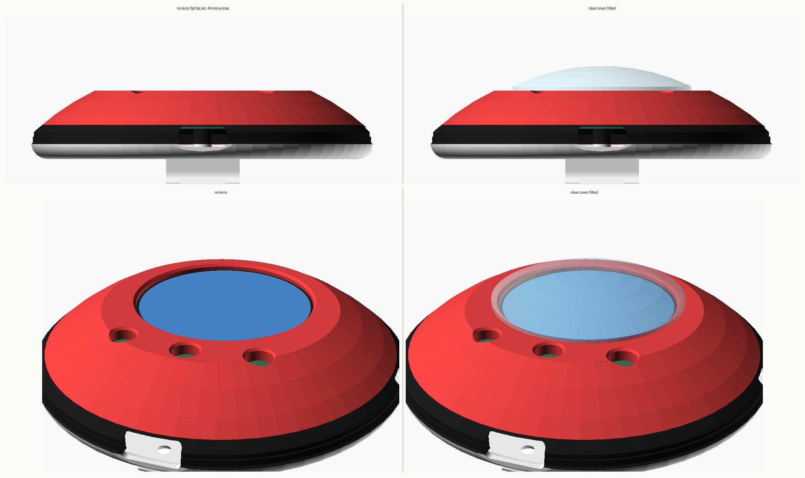

<section class="prose" markdown="1">

## A Game Boy link is six pins and almost no parts

The IrDA sheet is gone — the Vishay TFBS4711 and everything hanging off it. What replaced it
is a 74LVC2G17 dual Schmitt buffer and five resistors.

Two of the six EXT pins are driven by the console at 5 V TTL, and those go through the buffer
to get down to 3.3 V. Its inputs are 5 V tolerant at a 3.3 V supply, so there is no divider
and no bidirectional shifter. The leg going the other way needs nothing at all: TTL's input
threshold is 2.0 V, so the device's 3.3 V output drives the console directly.

The device is the clock **slave**. A Game Boy link has no chip select, which is why this is a
job for the RP2350's PIO rather than its PL022 — the hardware SPI's slave mode wants a select
line to stay byte-aligned, and there isn't one.

<figure class="narrow" style="max-width:none;">
  
  <figcaption>The whole interface. Five of the six pins are used; P14 is a no-connect.</figcaption>
</figure>

Nothing in it is Gen-1 specific. The sheet carries SPI Mode 3 bytes and encodes no byte
counts, so a Gen 2 trade is a firmware problem, not a board respin.

## The connector is a row of pads, because nothing else fits

`J5` is a new footprint rather than a part off a shelf: a 1×6 row of 1.27 mm solder pads. The
largest free rectangle on the back copper near the MCU measures 6.25 × 6.25 mm, and the
smallest 6-way JST SH needs 9.8 × 5.2 mm. The only place a real connector fits is the far end
of the board, beside the USB-C and the power management.

Pads keep every connector option open, and they are what bring-up on a breadboard wants
anyway. Five test points sit on SCK, SI, SO, ground and the link's own 5 V — this interface
has never seen a console, so it is instrumented rather than trusted.

The placement came from a measured free-space map of the back copper, not from eyeballing it.
That board outline is a rounded Pokéwalker shape with three screw-hole cutouts in it, two of
them sitting right inside the band where the parts had to go, and KiCad's own board-polygon
call does not treat a cutout as off-board. A search that does not exclude them will happily
put a footprint in a hole.

## The Poké Ball look is paint, and it has to be

The shell is two machined halves split at the ball's own band, with the belt clip cut into the
back — the arrangement of the real device, whose clip lives on a swappable back cover.

<figure class="narrow">
  
  <figcaption>Face-on, the icon reads. The silhouette measures 1138 × 1136 px — a true circle to 0.2%.</figcaption>
</figure>

That picture cost an afternoon of looking for a camera angle before the geometry settled it.
A Poké Ball icon is a sphere seen level with its own equator. This part is a ⌀70 mm disc
19 mm thick, so the same level camera renders a 69.5 × 19 mm lens. There is no elevation that
turns a disc into a ball, and the only view whose silhouette is a true circle is straight at
the face — where the real band is edge-on at the rim and invisible.

So the stripe across the face is paint. The band round the equator is real: a 3.9 mm sunken
recess with a chamfered shoulder each side and the parting line down the centre of it,
0.6 mm deep at its deepest out of a 1.2 mm wall. Red above and white below is a render
choice; no finish decision has been made.

<figure class="narrow">
  
  <figcaption>From the angle a die-cast ball gets photographed at. The white back barely shows, and that is the model being honest: the dome stands 14 mm above the split line and the back only 5 mm.</figcaption>
</figure>

It is not a half-and-half ball and it cannot be while it is a Pokéwalker. Red covers about
three-quarters of the object's height because that is the real device's proportion. Making it
read 50/50 is a form-factor decision, not a paint one.

## Boring the screen pocket flattens the dome

The bezel has to be constant thickness over the window, so the outer surface is machined flat
out to the bezel radius — on ⌀70, a flat 44 mm across, sitting 5.02 mm below where the sphere
would have been. A fifth of the front is a disc. That is exactly why it looks faceted next to
a real Pokéwalker.

The real device does not solve this in the housing either. It puts a clear cover over the
front and lets that carry the curve the screen cannot. So does this one.

<figure class="narrow" style="max-width:none;">
  
  <figcaption>Left, the machined flat. Right, the cover that puts the apex back where the sphere had it.</figcaption>
</figure>

It is the tightest thing in the model. Measured from the screen centre, the window's chamfered
mouth ends at r=17.2 mm and the nearest button's mouth begins at r=18.47 mm. Everything the
cover needs on the face — flange, land, slip fit — lives in that 1.27 mm.

The check for it is an intersection rather than an assertion: the target builds the shared
volume of cover and shell and fails unless it comes out with zero facets. Forcing the fit
0.5 mm the wrong way makes it report 1280 facets, which is how you know the check has teeth.

## The plug cannot reach the socket

`make check` fails on the ⌀70 configuration, and it is right to.

The board's minimum enclosing circle is ⌀50.50 mm. The bore it sits in is ⌀67.6. That leaves
the USB-C receptacle's mouth **7.27 mm** inside the shell wall, and a USB-C plug seats its
overmould against the case with about 6.5 mm of nose — all of which is needed inside the
receptacle, not crossing seven millimetres of fresh air. No chamfer or funnel fixes it.

Three things do, and they are all board decisions: make the board reach the wall, move the
connector out on a flex or riser, or give up on USB-C and accept a recessed pogo or magnetic
charger. It is a tighter trade than it looks. In a ⌀60 shell the bore is ⌀57.6 at the split
plane but the dome has already narrowed to ⌀54.9 a millimetre above it, so a board big enough
to reach the wall has to sit at or below the split line — which eats the space underneath that
the receptacle needs, and the back has to get deeper to pay for it.

And ⌀48, the size that gets quoted as the answer, does not satisfy it either: in a ⌀60 shell a
⌀48 board still leaves a 4.8 mm gap and the plug still cannot reach.

## The clip will go slack

Report and instinct both say a printed 316L clip takes a set and stops gripping. Machining it
does not help, because that is not a process problem — 316L is not a spring material in any
process. As drawn, the clip grips when new and goes soft.

Three ways out, none of which change the geometry: machine the back from 17-7 PH in condition
A and age-harden it afterwards, machine it in titanium TC4, or redraw the clip as a hook that
barely flexes and lets geometry do the retention. The back is a separate piece held by three
screws, so trying a second one in a different material is cheap.

## What the numbers are

Both configurations export and both were weighed from the real solid volumes at 7.98 g/cm³,
not estimated from a wall thickness: **86.1 g** for ⌀70 (front 36.4, back 49.7) and **62.7 g**
for ⌀60. Both are a long way under the 143 g a solid ⌀70 ball suggests, because a flat-backed
Pokéwalker is a long way from a sphere. The clear cover adds about 1.3 g in acrylic.

Every dimension that could plausibly change is a named parameter, and the model asserts its
own rules while it renders — that the band leaves at least 0.5 mm of wall, that the screw
heads stay on the flat, that the bosses clear the board. The board geometry is not typed in
either: the outline, the mounting holes, the buttons and every footprint's courtyard are
pulled straight out of the `.kicad_pcb`, so a board change and a stale shell cannot coexist
quietly.

## What is not done

The link nets are placed but not routed, and hand-routing is the only option. Freerouting was
tried properly on this board and is not usable: it plateaus at 62 unrouted and 417 violations,
its fanout stage rewrites the whole board rather than the nets you asked for, and importing
its result takes the board from 981 tracks to 203 — it wipes routing on seventy nets that were
already fine. It also routes straight through the screw-hole cutouts, because the export
format does not carry them as keepouts.

Beyond that: the interface has never been run against a console, the ball size is still open,
and a keyed bayonet joint that makes the front half swappable — Poké Ball, Great Ball, Ultra
Ball, and a Team Rocket ball that is a fan design rather than canon — is drawn and parked
until the side buttons are settled, because the lugs have to miss the ports.

</section>
