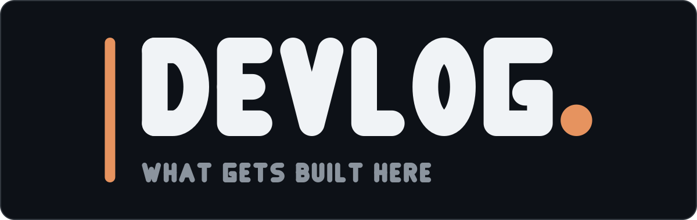

# devlog brand

**The mark is [`devlog-logo.svg`](devlog-logo.svg), its square icon lockup is
[`devlog-icon.svg`](devlog-icon.svg), and its link-preview card is
[`devlog-og.svg`](devlog-og.svg). These three files are the only ones to ship —
anywhere.**



## The composition

The devlog is where [TerminalGB](https://github.com/Alchemy86/TerminalGB), AtlasGB and
GBSelfTest get written up, so its mark keeps everything that makes those recognisable:
the near-black panel with its faint border, the same heavy geometric alphabet, the same
tight tracking, the grey wide-tracked tagline, and the accent full stop closing the word —
which the site's own masthead has always drawn in text as `devlog<span class="dot">.</span>`.

Two things are the devlog's own.

**The accent is amber, not DMG green.** The siblings are Game Boy tools and wear the LCD
lit shade `#9bbc0f`; this is a blog that happens to be mostly about them, and the site
is not defined as a Game Boy family. It wears its own burnt amber instead. Specifically
the *dark-mode* amber from `_data/palettes.yml` (`#E6935F`, 7.84:1 on the panel) rather
than the light-mode `#A8431F`, which would sit on a near-black panel at 3.14:1 and fail
AA. The palette had already solved that problem for the site's dark theme; the mark
inherits the answer.

**The motif is the margin rule.** It is not invented for the mark — `.pullquote` in
`assets/css/main.css` is `border-left: 2px solid var(--accent)`, and it is the one place
the design system marks a passage as worth stopping on. The mark is a whole entry set
against that rule: the wordmark, then the tagline, both hanging off one accent line in
the margin. Every sibling centres its tagline under its wordmark; this one does not, and
that is the point. A log is left-aligned against its margin, and centring the block would
put the rule beside nothing.

The tagline is the front page's own opening line — *a running record of what gets built
here*.

The icon is that entry alone: the rule, and three lines of writing beside it with the last
one short. Four marks that all have to survive 16 px have to stay apart at 16 px too, and
this is the only one of the four that is two colours — an amber column with white rows
next to it, against TerminalGB's one tall green block, AtlasGB's four full-width green
rows and GBSelfTest's tick. [`preview/icon-16.png`](preview/icon-16.png) is the real
favicon test, not a resized illustration.

[`devlog-og.svg`](devlog-og.svg) has no sibling: the others are repositories, and this is
a website whose links get unfurled. 1200×630 is the frame every unfurler crops to, so the
mark is drawn at that size rather than letterboxed into it.

## Licence and provenance

Everything here is **hand-authored**: the letterforms are original stroked skeleton paths
drawn in [`generate.py`](generate.py); **no font is embedded, subset or traced**, so there
is no third-party licence in any of these files. Every letter is a shape TerminalGB's,
AtlasGB's or GBSelfTest's generator already draws, carried over unchanged so all four
wordmarks are visibly the same alphabet — that is our work in each of those places.
`DEVLOG` and `WHAT GETS BUILT HERE` between them needed nothing new cut.

No Nintendo artwork, logotype or trade dress is used or imitated; the whole vocabulary is
a rule, a word and a full stop.

## Regenerating

**Edit the generator, never the SVGs by hand**, and re-render the previews in the same
commit:

```bash
python3 docs/brand/generate.py
cd docs/brand
magick -background none devlog-logo.svg preview/logo.png
magick -background none devlog-og.svg   preview/og.png
magick -background none devlog-icon.svg preview/icon-128.png
magick -background none devlog-icon.svg -resize 16x16 preview/icon-16.png
```

The site serves its own copies out of `assets/img/brand/`, so a regeneration is not
finished until those are refreshed too. The SVGs are copied byte-for-byte; the rasters the
site serves are re-rendered from them and then losslessly recompressed the way every other
image in this repository is (`AE` must print `0`):

```bash
cp docs/brand/devlog-icon.svg docs/brand/devlog-logo.svg assets/img/brand/
sha1sum docs/brand/devlog-icon.svg assets/img/brand/devlog-icon.svg   # must match

cp docs/brand/preview/og.png       assets/img/brand/devlog-og.png
cp docs/brand/preview/icon-128.png assets/img/brand/devlog-icon-128.png
magick -background none docs/brand/devlog-icon.svg -resize 180x180 \
  assets/img/brand/devlog-icon-180.png
for f in devlog-og devlog-icon-128 devlog-icon-180; do
  cp assets/img/brand/$f.png /tmp/pre.png
  magick /tmp/pre.png -strip -define png:compression-level=9 \
    -define png:compression-filter=5 assets/img/brand/$f.png
  magick compare -metric AE /tmp/pre.png assets/img/brand/$f.png null:
done
```

`devlog-icon-180.png` is the `apple-touch-icon`: iOS ignores an SVG favicon and wants a
raster at that size.

Every SVG paints its own panel, so it survives GitHub light mode, dark mode and a pure
black page — nothing is theme-conditional, so there is no `prefers-color-scheme` trap, and
the favicon does not change when the reader's system theme does.

## Gotcha

`--` cannot appear inside an XML comment. Each of these files opens with a comment naming
what it is, so a description written with two hyphens instead of an em dash produces an
SVG that no renderer will parse and that fails with an error pointing at the image data,
not at the comment. `svg()` asserts against it.

## Files

- [`devlog-logo.svg`](devlog-logo.svg) — **the** wordmark lockup, 1200×380
- [`devlog-icon.svg`](devlog-icon.svg) — **the** square icon lockup, 128×128
- [`devlog-og.svg`](devlog-og.svg) — **the** link-preview card, 1200×630
- [`preview/logo.png`](preview/logo.png), [`preview/og.png`](preview/og.png),
  [`preview/icon-128.png`](preview/icon-128.png),
  [`preview/icon-16.png`](preview/icon-16.png) — rendered previews at hero, unfurl,
  avatar and favicon size
- [`generate.py`](generate.py) — the only source of truth; edit it, never the SVGs
